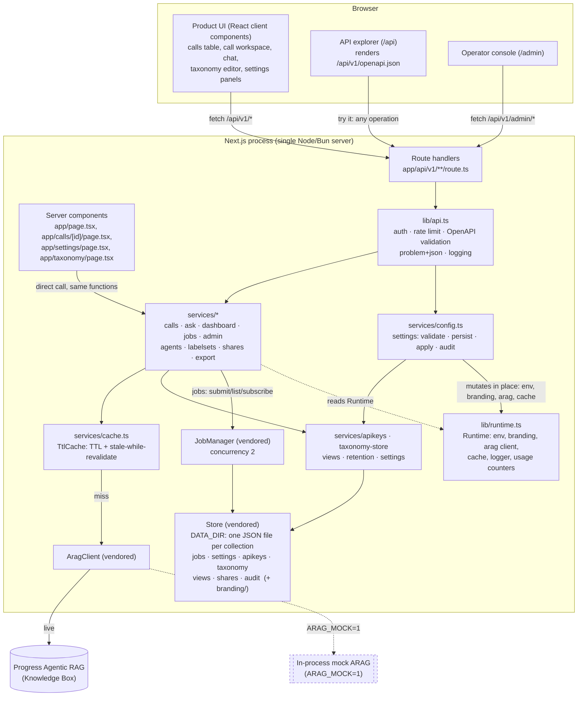

# Architecture

## Component view

Every arrow into ARAG is server-side only: the browser never receives the service-account key.
Media playback and the ask stream both proxy through a route handler for the same reason (see
[ARAG integration](arag-integration.md) and [Security model](security-model.md)).

The one arrow that is new in shape rather than in detail is `services/config.ts → lib/runtime.ts`:
a settings write does not only persist, it reaches back into the live runtime container. That is
the subject of the next two sections.

## What `DATA_DIR` holds

The vendored `Store` writes one JSON file per collection. Until this pass that was job history and
nothing else; it is now this deployment's configuration as well.

| Collection | File | Cap | What it is |
|---|---|---|---|
| `jobs` | `jobs.json` | 500 | Ingest, sample-load, re-analysis and provisioning records |
| `settings` | `settings.json` | one document (`current`) | The `branding`, `connection`, `limits` and `retention` overrides |
| `apikeys` | `apikeys.json` | 500 | API keys as SHA-256 digests, with names and last-used times |
| `taxonomy` | `taxonomy.json` | 200 | Labelset definitions (`labelset:<id>`) and agent overrides (`agent:<key>`) |
| `views` | `views.json` | 100 | Saved views on the calls list |
| `shares` | `shares.json` | 2,000 | Share links, revoked and expired ones included |
| `audit` | `audit.json` | 5,000 | Who changed what, and when |

Plus `DATA_DIR/branding/`, holding an uploaded partner logo as a file — a base64 image in a
settings row would be re-read on every read of every unrelated setting.

Call data itself is still entirely ARAG-native: no recording, transcript, label or generated
analysis is ever written here. But the operational consequence has changed, and the change is not
small: losing `DATA_DIR` now loses a deployment's settings, keys, taxonomy edits, saved views,
share links and audit trail as well as its job history. See
[Deployment topologies](deployment-topologies.md) for what that means for backups and for a second
machine.

The caps that are this product's own — taxonomy 200, views 100, shares 2,000, audit 5,000 — exist
because each of these files is read in full on every access. An unbounded audit trail is the
file that eventually fills the volume; a capped one is evidence rather than an archive.

## The runtime container, and why "no restart" is true

`lib/runtime.ts` builds one `Runtime` per process and memoises it on `globalThis`, so Next.js'
module reloading in development does not spawn duplicates. Every read path in the product — route
handlers and server components alike — reaches configuration through that container: `rt.env` for
the scalar limits, `rt.branding` for the identity the layout renders, `rt.arag` for the Knowledge
Box client, `rt.cache` for the read cache.

A settings write therefore does not rebuild the container. `applyToRuntime()`
(`services/config.ts`) **mutates it in place**:

- `rt.env.maxQuestionChars`, `maxUploadBytes`, `rateLimitRps`, `rateLimitBurst`, `cacheTtlMs` are
  assigned directly. Every request path already reads them per request, so the next request sees
  the new value.
- `rt.branding` is replaced with a merged object, its colours and URLs passed back through
  `safeColor`/`safeLogoUrl` on the way in.
- `rt.env.arag.generativeModel` and `reranker` are assigned directly.
- When a connection field changes on a live deployment, a new `AragClient` is constructed and
  assigned to `rt.arag` wholesale, and the cache is cleared — every entry in it was produced by
  the previous Knowledge Box. Call sites read `rt.arag` at call time, so the swap is atomic from
  their point of view.
- When `cacheTtlMs` changes, `rt.cache` is replaced with a new `TtlCache`. An entry's expiry is
  decided when it is written, so `TtlCache.ttlMs` is readonly by design; discarding the entries is
  the correct reading of the change, because they were admitted under a policy that no longer
  applies.

This is the whole mechanism behind "a setting takes effect on the next request with no restart".
The alternative considered and rejected was an `effectiveSettings()` object every consumer would
have to remember to consult, which is one forgotten call site away from a setting that saves and
silently does nothing (DECISIONS D-CA-34). Mutating the container means every existing read path
picks the new value up for free.

Two supporting details make a *reset* a real operation rather than a redeploy: `rt.envBranding`
and `rt.envDefaults` are snapshots of what the environment supplied, taken at boot, because
without them the original value is gone the moment the first override is applied. And
`applyToRuntime()` runs once inside `buildRuntime()`, after the store exists and before anything
else can read the runtime, so the first request after a restart sees the same configuration the
last one did.

One deliberate exception: connection edits are ignored in mock mode. The mock Knowledge Box is an
in-process server with its own address, and re-pointing the client at a partner's Knowledge Box
from the settings screen while running on sample data would break the sample data with no way back
through the UI. The write is stored; the client is left alone. `generativeModel` and `reranker`
still apply.

## Why one service layer

Two callers exist for the same domain logic:

- **Route handlers** (`app/api/v1/**/route.ts`) — the public, versioned contract every external
  integrator and the browser's client components use.
- **React server components** (`app/page.tsx`, `app/calls/[id]/page.tsx`) — server-rendered pages
  that need the same data (the dashboard aggregation, a call's detail) but render HTML directly
  rather than calling their own API over HTTP.

Both call into `services/*` (`services/calls.ts`, `services/dashboard.ts`, etc.) through the same
shared `Runtime` (`lib/runtime.ts`'s `getRuntime()`), never into ARAG directly and never into each
other. This is a deliberate, enforced rule (`CONTRIBUTING.md`: "one service layer... never talk to
ARAG from a component or a handler directly") for one reason: a second implementation of "how to
list calls" or "how to build the dashboard" is a second place server components and the API can
disagree on numbers, caching, or label handling. `services/dashboard.ts`'s own comment states the
intent directly: "so the server component and the API produce byte-identical numbers."

Concretely, `app/page.tsx` (the dashboard) calls `dashboard(await getRuntime())` from
`services/dashboard.ts` — the exact function `GET /api/v1/dashboard`'s route handler
(`app/api/v1/dashboard/route.ts`) also calls. Neither knows or cares that the other exists.

## How the adapter relates to the platform `App`

The vendored platform (`vendor/arag-platform/src/http/app.ts`) ships a complete HTTP router
(`App`) with its own middleware pipeline (auth, rate limiting, validation, docs, static serving)
built on `node:http`. Every other ARAG product mounts that router directly. This product cannot:
Next.js's App Router owns `app/api/v1/**/route.ts` as file-based routes, and two routers cannot
both own the same URL space in one process (D-CA-01).

Instead, `lib/api.ts` is a thin adapter that reimplements the same *behavior* — request ids,
authentication, per-IP token-bucket rate limiting, OpenAPI-driven validation, RFC 9457 problem
responses, security headers, access logging, usage counters — as a `route()` wrapper each Next.js
handler applies itself, operating on the Fetch API's `Request`/`Response` (which Next.js route
handlers use) instead of `node:http`'s `IncomingMessage`/`ServerResponse` (which the platform
`App` uses). The authentication and rate-limiting logic in `lib/api.ts` (`authenticate`,
`rateLimit`) is a direct, intentional port of the equivalent platform code
(`vendor/arag-platform/src/http/app.ts`'s `App.authenticate`/`App.rateLimited`) — about 60 lines,
kept because it needs to read from a `Request` rather than a `Ctx`.

One piece is *not* reimplemented: session cookies. `lib/runtime.ts` constructs a real platform
`App` instance (`new App({ env, log })`) purely for its `issueSession`/`verifySession` HMAC
methods, so the signed `arag_session` cookie this product issues (`POST /api/v1/session`) uses
byte-identical signing to every other ARAG product, even though this product's `App` instance
never calls `.listen()` or serves a single route.

## Further reading

- [ARAG integration](arag-integration.md) — exactly which ARAG capabilities are used and how.
- [Data flow](data-flow.md) — sequence diagrams for ingestion and for asking a question.
- [Scaling](scaling.md) — where the single-process assumptions (in-memory cache, rate limiter, job
  manager, and now the per-machine settings store) stop scaling and what changes at 10x/100x.
- [Security model](security-model.md) — the four auth levels, how API keys are stored and
  verified, the write-only secret rule and the audit trail.
- [Extension points](../developer/extension-points.md#the-settings-model-environment-defaults-store-authority)
  — how to add a setting, and the checklist that keeps a new one from saving without effect.
