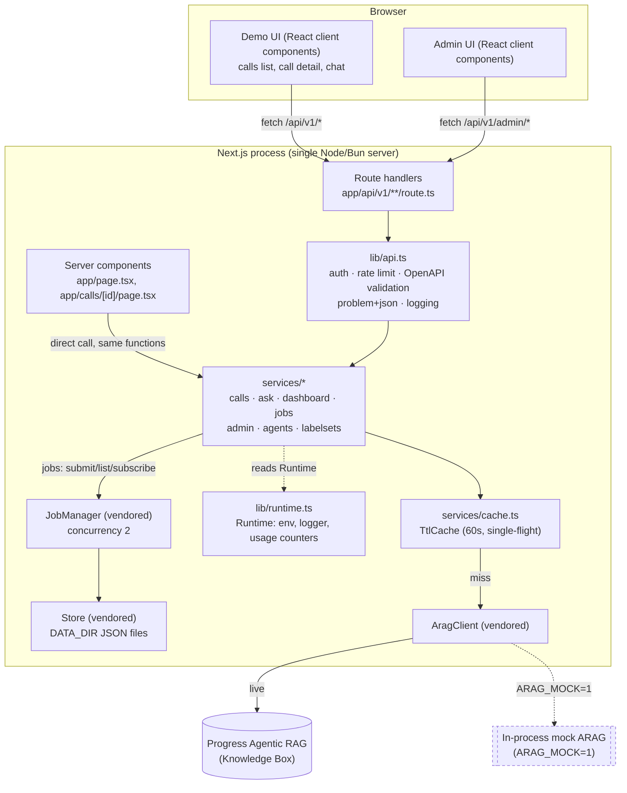

# Architecture

## Component view

Every arrow into ARAG is server-side only: the browser never receives the service-account key.
Media playback and the ask stream both proxy through a route handler for the same reason (see
[ARAG integration](arag-integration.md) and [Security model](security-model.md)).

## Why one service layer

Two callers exist for the same domain logic:

- **Route handlers** (`app/api/v1/**/route.ts`) — the public, versioned contract every external
  integrator and the browser's client components use.
- **React server components** (`app/page.tsx`, `app/calls/[id]/page.tsx`) — server-rendered pages
  that need the same data (the dashboard aggregation, a call's detail) but render HTML directly
  rather than calling their own API over HTTP.

Both call into `services/*` (`services/calls.ts`, `services/dashboard.ts`, etc.) through the same
shared `Runtime` (`lib/runtime.ts`'s `getRuntime()`), never into ARAG directly and never into each
other. This is a deliberate, enforced rule (`CONTRIBUTING.md`: "one service layer... never talk to
ARAG from a component or a handler directly") for one reason: a second implementation of "how to
list calls" or "how to build the dashboard" is a second place server components and the API can
disagree on numbers, caching, or label handling. `services/dashboard.ts`'s own comment states the
intent directly: "so the server component and the API produce byte-identical numbers."

Concretely, `app/page.tsx` (the dashboard) calls `dashboard(await getRuntime())` from
`services/dashboard.ts` — the exact function `GET /api/v1/dashboard`'s route handler
(`app/api/v1/dashboard/route.ts`) also calls. Neither knows or cares that the other exists.

## How the adapter relates to the platform `App`

The vendored platform (`vendor/arag-platform/src/http/app.ts`) ships a complete HTTP router
(`App`) with its own middleware pipeline (auth, rate limiting, validation, docs, static serving)
built on `node:http`. Every other ARAG product mounts that router directly. This product cannot:
Next.js's App Router owns `app/api/v1/**/route.ts` as file-based routes, and two routers cannot
both own the same URL space in one process (D-CA-01).

Instead, `lib/api.ts` is a thin adapter that reimplements the same *behavior* — request ids,
authentication, per-IP token-bucket rate limiting, OpenAPI-driven validation, RFC 9457 problem
responses, security headers, access logging, usage counters — as a `route()` wrapper each Next.js
handler applies itself, operating on the Fetch API's `Request`/`Response` (which Next.js route
handlers use) instead of `node:http`'s `IncomingMessage`/`ServerResponse` (which the platform
`App` uses). The authentication and rate-limiting logic in `lib/api.ts` (`authenticate`,
`rateLimit`) is a direct, intentional port of the equivalent platform code
(`vendor/arag-platform/src/http/app.ts`'s `App.authenticate`/`App.rateLimited`) — about 60 lines,
kept because it needs to read from a `Request` rather than a `Ctx`.

One piece is *not* reimplemented: session cookies. `lib/runtime.ts` constructs a real platform
`App` instance (`new App({ env, log })`) purely for its `issueSession`/`verifySession` HMAC
methods, so the signed `arag_session` cookie this product issues (`POST /api/v1/session`) uses
byte-identical signing to every other ARAG product, even though this product's `App` instance
never calls `.listen()` or serves a single route.

## Further reading

- [ARAG integration](arag-integration.md) — exactly which ARAG capabilities are used and how.
- [Data flow](data-flow.md) — sequence diagrams for ingestion and for asking a question.
- [Scaling](scaling.md) — where the single-process assumptions (in-memory cache, rate limiter, job
  manager) stop scaling and what changes at 10x/100x.
