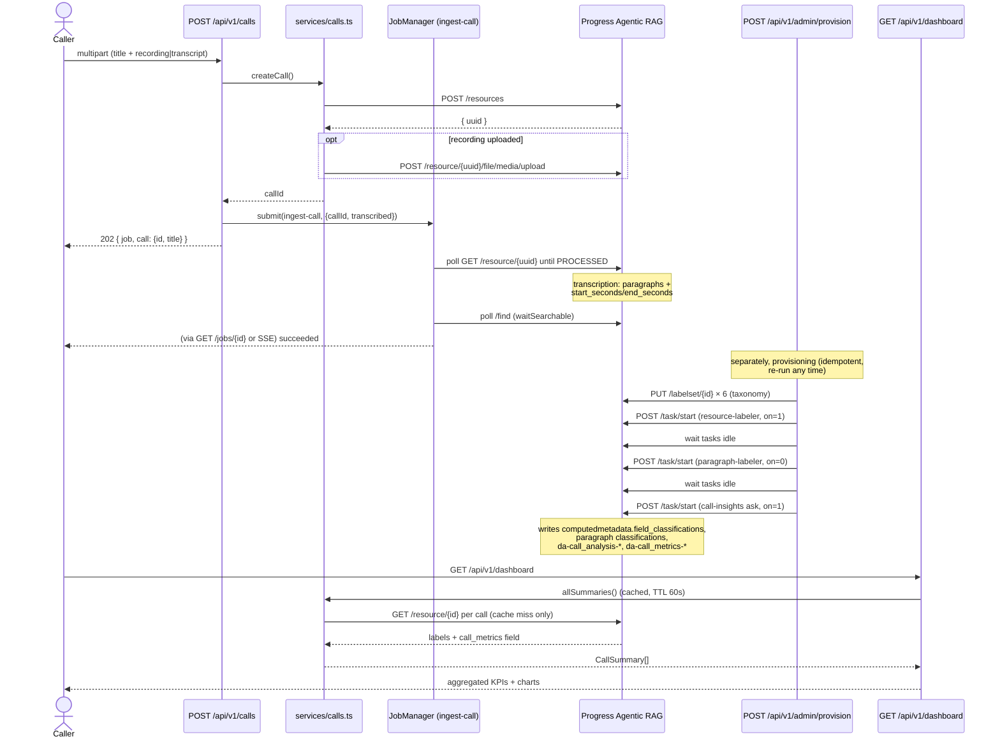
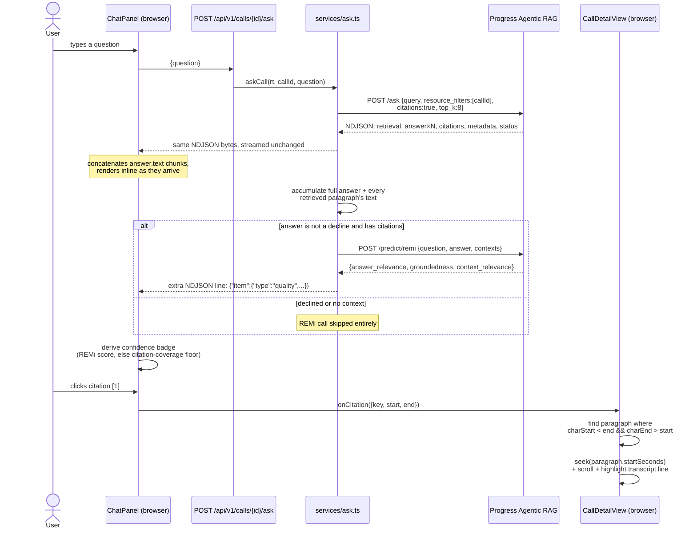
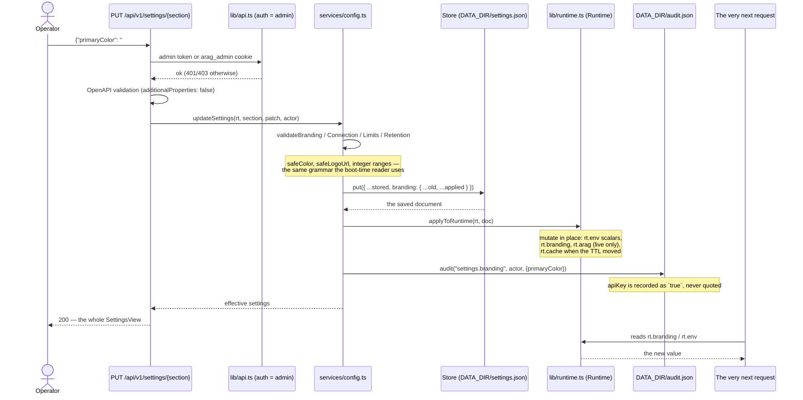
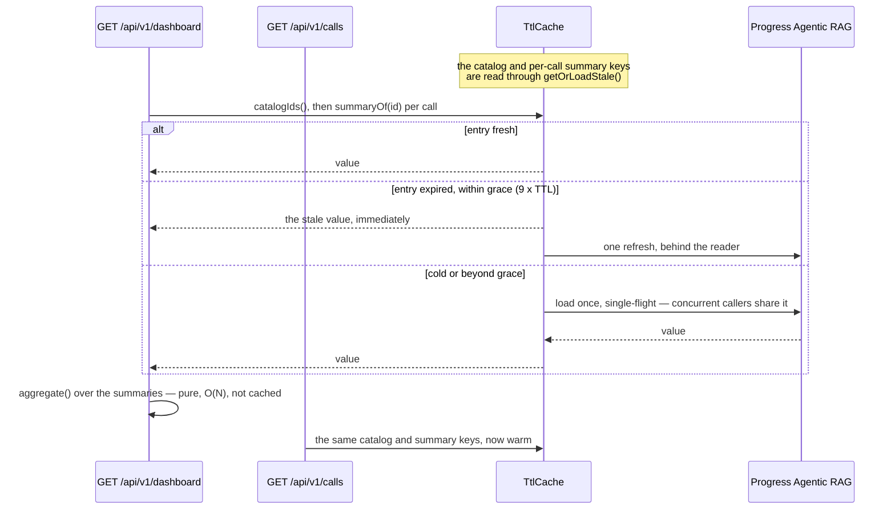

# Data flow

## Upload -> resource -> transcription -> agents -> labels/metrics/analysis -> dashboard

Two things worth noting that aren't obvious from the diagram: the resource is created and
returned to the caller **synchronously** (step 1–4) — the job only tracks the slow part
(transcription and searchability) — and provisioning is a separate, idempotent, re-runnable flow
from ingestion: uploading a call does not itself run the agents over it. Agents run over whatever
resources exist in the Knowledge Box at the moment they are started, so a freshly uploaded call
only gets labels/analysis after a provisioning run (or, in mock mode, the agents that ran once at
boot over the seeded calls).

## A question -> scoped ask -> NDJSON -> citations -> transcript paragraph -> media scrub

The confidence badge shown to the user is never a raw REMi number: `lib/confidence.ts` buckets
both the instant citation-coverage estimate and the REMi score into the same four qualitative
levels (`high` / `moderate` / `low` / `none`), and a declined answer ("Not enough data to answer
this.") shows no badge at all rather than a REMi score that measured relevance rather than
whether an answer was actually given (see
[ARAG integration](arag-integration.md#gotchas-the-hard-won-parts)).

## A settings edit -> validate -> persist -> apply to the runtime -> audit

Four things in that sequence are load-bearing.

**Validation is the same grammar as boot.** A colour or URL that arrives from a signed-in
operator's form goes through `safeColor`/`safeLogoUrl` exactly as a value from the environment
does. A settings screen must not be a way past the checks the environment gets. An unrecognised
key is a 400 rather than a silent no-op, so a typo in a partner's automation fails loudly.

**Persist before apply.** The store write happens first and the runtime is applied from the
document that came back, so what is in force is always what is on disk — a process that crashes
between the two comes back with the setting, not without it.

**Apply mutates the memoised container.** This is what makes "no restart" true; see
[Architecture](architecture.md#the-runtime-container-and-why-no-restart-is-true). The response is
the *whole* settings view rather than the section that changed, because a limits change moves
`features` and a connection change moves `connection.mode` — returning a fragment would leave the
screen showing a stale version of the thing next to the thing that changed.

**Audit last, with the secret reduced to a boolean.** The entry records the keys that changed and
their non-secret values; `apiKey` is written as `true`. An audit trail that quotes the credential
is a second place to leak it.

`DELETE /api/v1/settings/{section}` runs the same path in reverse: the section is removed from the
stored document, `rt.branding` is restored from `rt.envBranding` and the overridable scalars from
`rt.envDefaults`, the remaining overrides are re-applied over the top, and a
`settings.<section>.reset` entry is audited.

## Read caching: what changed, and why a drill-through used to stall

The dashboard aggregate is deliberately **not** cached under a key of its own. It used to be
(`dashboard:all`), and that was a real bug: the entry was written only once its loader resolved,
so it was stamped later than the `summary:<id>` entries it was built from — by the whole per-call
fan-out. For that difference the dashboard rendered instantly from its own entry while quietly
re-warming nothing, and the next screen to read (in practice the calls list, one drill-through
click later) paid the entire cold load, measured at about eight seconds on a live Knowledge Box.

`aggregate()` is pure and O(N) over a few hundred summaries, so re-running it per render costs
nothing measurable, and every dashboard render now re-warms exactly the entries the calls list
reads next. Raising the TTL would only have widened the stale window without removing the cliff
(DECISIONS D-CA-40).

Stale-while-revalidate is only correct because every mutation in this product invalidates its keys
outright — `delete`, `invalidatePrefix` or `clear` — rather than letting them age out. Staleness
is therefore bounded by the TTL, never by a write nobody noticed. Two supporting changes ship with
it: `/calls` has its own `loading.tsx`, and the dashboard's drill-through links drop Next.js'
prefetch, which was saturating the browser's connection pool immediately before the click.
