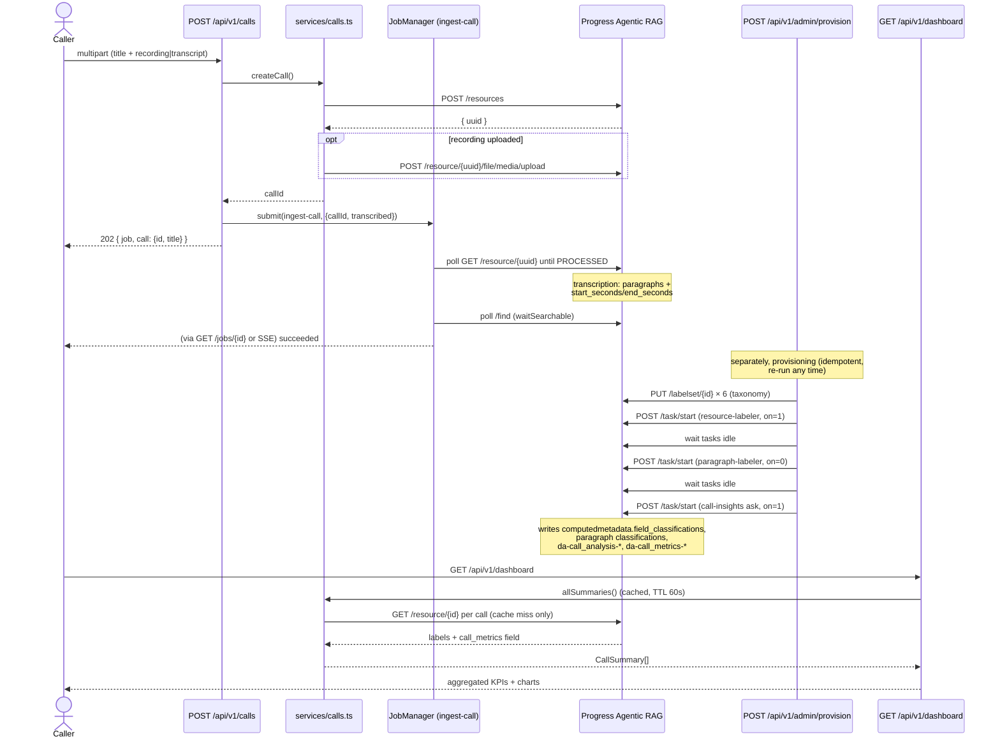
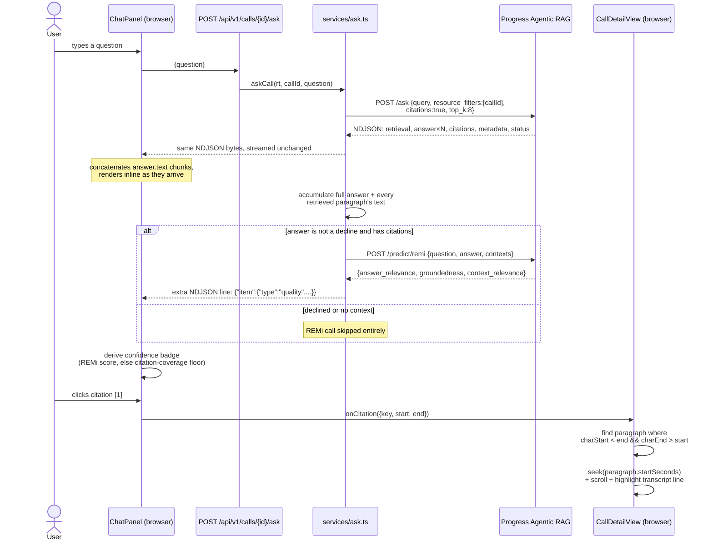

# Data flow

## Upload -> resource -> transcription -> agents -> labels/metrics/analysis -> dashboard

Two things worth noting that aren't obvious from the diagram: the resource is created and
returned to the caller **synchronously** (step 1–4) — the job only tracks the slow part
(transcription and searchability) — and provisioning is a separate, idempotent, re-runnable flow
from ingestion: uploading a call does not itself run the agents over it. Agents run over whatever
resources exist in the Knowledge Box at the moment they are started, so a freshly uploaded call
only gets labels/analysis after a provisioning run (or, in mock mode, the agents that ran once at
boot over the seeded calls).

## A question -> scoped ask -> NDJSON -> citations -> transcript paragraph -> media scrub

The confidence badge shown to the user is never a raw REMi number: `lib/confidence.ts` buckets
both the instant citation-coverage estimate and the REMi score into the same four qualitative
levels (`high` / `moderate` / `low` / `none`), and a declined answer ("Not enough data to answer
this.") shows no badge at all rather than a REMi score that measured relevance rather than
whether an answer was actually given (see
[ARAG integration](arag-integration.md#gotchas-the-hard-won-parts)).
