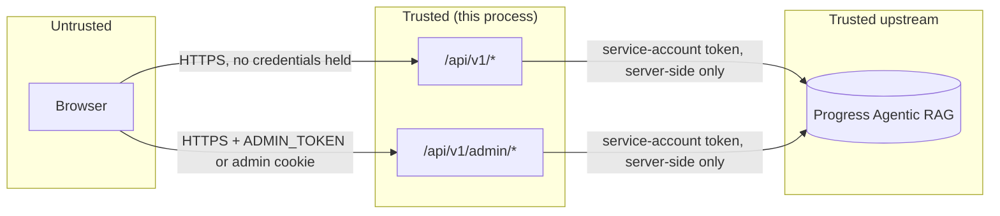

# Security model

This expands [`SECURITY.md`](../../SECURITY.md) into a threat model: what's protected, from whom,
and what the MVP honestly does not cover yet.

## Assets

| Asset | Where it lives | Why it matters |
|---|---|---|
| ARAG service-account token (`ARAG_API_KEY`) | Server process env only | Grants read/write on the entire Knowledge Box — every call recording, transcript and generated analysis |
| Admin token (`ADMIN_TOKEN`) | Server process env only | Grants access to `/admin` and `/api/v1/admin/*`: config (redacted), usage, logs, agent control, provisioning, cache control |
| Call recordings and transcripts | ARAG Knowledge Box | Potentially sensitive: health-insurance calls carry PII/PHI-shaped content by design (the demo taxonomy has a dedicated "Sensitive / PII" moment label) |
| Generated analysis (`call_analysis`, `call_metrics`) | ARAG Knowledge Box | Model-authored judgments (sentiment, compliance score, complaint category) about real people and agents |
| Job records | `DATA_DIR/jobs.json` | Operational metadata only — no recording bytes are ever written to `DATA_DIR` (D-CA-05 keeps the job input to `{callId, title, transcribed}`) |
| Deployment settings | `DATA_DIR/settings.json` | Now the *authority* over the environment: branding, connection, limits and retention. It can hold a service-account token (`connection.apiKey`), which is why it is a secret-bearing file and why no read model ever returns that field |
| API-key store | `DATA_DIR/apikeys.json` | SHA-256 digests only. A leaked store grants nothing — but it does disclose how many keys exist, their names and their last-used times |
| Taxonomy, saved views, share links | `DATA_DIR/taxonomy.json`, `views.json`, `shares.json` | Configuration and application state. A share token grants read-only access to one call, and is the only secret among them — so `shares.json` holds a SHA-256 digest of it, never the token. The token is returned exactly once, when the link is created, exactly as an API key is |
| Audit trail | `DATA_DIR/audit.json` | Who changed what, and when. Capped at 5,000 records; secrets appear only as `true` |

## Trust boundaries

The browser is the only untrusted boundary. It never holds the ARAG service-account token or the
admin token in a readable form: media streams and the ask NDJSON stream are both proxied by a
route handler; the admin token is exchanged for an `HttpOnly` cookie at login
(`POST /api/v1/admin/login`) and never stored in `localStorage` or read back by client JavaScript
(`app/admin/login/page.tsx`).

## Authentication and authorization

Three credentials (`lib/api.ts`'s `authenticate`) and four route levels (`RouteAuth` in
`lib/openapi.ts`). Every route declares its level in `API_ROUTES`, and a contract test asserts the
split so it cannot erode.

### The credentials

1. **`ADMIN_TOKEN`** — bearer token or the `arag_admin` `HttpOnly` cookie, compared with a
   constant-time equality check (`constantTimeEqual`) to avoid timing side-channels. With no
   `ADMIN_TOKEN` configured, every admin route returns `403` outright rather than silently
   allowing access — admin is opt-in, not fail-open.
2. **An API key** — `X-API-Key` or `Authorization: Bearer`, verified against the key store
   (below). `API_KEYS` is a seed for that store, not a separate mechanism.
3. **Session cookie (`arag_session`)** — `POST /api/v1/session` issues an HMAC-signed,
   short-lived (12 h) cookie so the product UI can call `auth: "api"` routes without ever holding
   a real key in browser JavaScript. Signed by the platform `App`'s `issueSession`, verified with
   `timingSafeEqual`.

### The four levels

| Level | Rule | What sits here |
|---|---|---|
| `none` | Open | Every read: calls, a call, media, ask, exports, dashboard, branding, settings (non-sensitive), taxonomy, labelsets, agents, jobs, onboarding, `GET /api/v1/views`, `GET /api/v1/shares`, `GET /api/v1/retention/preview`, `GET /api/v1/shares/{token}`; plus `POST /api/v1/session` and `POST /api/v1/admin/login` |
| `api` | Open unless at least one key is active, then a key or the session cookie | Creating and revoking share links, and creating, updating and deleting saved views |
| `write` | Always the admin token or an API key — never the session cookie | Anything that changes the Knowledge Box: upload, bulk actions, delete, re-analyse, sample seeding, labelset create/edit/delete/provision, agent edit/start/stop, and job cancellation |
| `admin` | Always `ADMIN_TOKEN` | Everything that changes the deployment for everyone: `PUT`/`DELETE /api/v1/settings/{section}`, `POST`/`DELETE /api/v1/settings/logo`, the whole of `/api/v1/api-keys`, `POST /api/v1/retention/purge`, and all of `/api/v1/admin/*` |

`write` has one exception: a deployment with neither `ADMIN_TOKEN` nor an active API key can only
be a local mock run, so it is allowed — and even that is refused when `NODE_ENV=production`, with
a 403 naming the variables to set (DECISIONS D-CA-13).

### Why the split falls where it does

**Operator-only means "changes the deployment for everyone".** An API key is a credential for
*using* the product's data. It must not be able to re-point the deployment at a different
Knowledge Box, mint itself a new key, or purge the corpus. Those are the operator's job, so
settings, API-key management and the purge are `admin` (DECISIONS D-CA-42).

**Taxonomy and agent editing are not operator-only.** Editing a labelset changes what the product
classifies with, which is the product's job, not the deployment's. It sits at `write` alongside
uploading a call: both change the Knowledge Box, and both need a real credential rather than the
freely issued session cookie.

**Saved views and share links sit at read level, on purpose.** Both write application state only,
and neither grants any access the read API does not already give: a share link points at a call
any reader can already fetch, and a saved view is a name for a query string a reader can already
type. Putting them behind the write credential would mean a reviewer could read every call but not
name the queue they review, which protects nothing. The control that matters for a share link is
*revocation*, and that is available to every caller who can create one (D-CA-27, D-CA-39). The
contract test's rule that mutations must not sit at read level exempts these two by name, with the
reason recorded.

**The read of settings stays open; only the write is behind the token.** The product has to be
able to render what it is configured with. `GET /api/v1/settings` therefore carries no secrets at
all — the Knowledge Box id is truncated, no key material appears, and the operator's full
effective environment lives in a separate read model at `GET /api/v1/admin/config`. The two are
deliberately separate models rather than one with fields stripped at the edge, so a future change
to the operator view cannot leak into the product view by accident.

Server components use `lib/session.ts` (`isOperator()`) to decide whether to render editable
controls or an honest read-only view with a route to sign in, rather than showing everyone a form
that 401s on Save. That is a UI affordance and never the access control: the route checks again.

There is **no per-user identity or per-call authorization** anywhere in this model — see "Known
MVP limitations" below.

## The API-key store

Keys are stored as **SHA-256 digests** (`services/apikeys.ts`), exactly as a password would be.
The material is returned once, by `POST /api/v1/api-keys`, and never again: every later read
returns `ca_live_XXXXXXXX…`, the prefix plus the first eight characters, so a key can be told
apart in a list without being recoverable. A leaked `apikeys.json` therefore grants nothing.

SHA-256 rather than a password KDF is deliberate. The token is 192 bits from `randomBytes`, so
there is nothing to brute-force offline, and a slow hash would only make every authenticated
request slower. The digest comparison still runs through `constantTimeEqual`, and **every active
key is compared even after a match**, so the time taken reveals neither which key matched nor how
many keys exist.

`API_KEYS` becomes a **one-time seed**. On first boot each comma-separated value is imported as a
managed key named "Environment key N", after which it is named, revoked and audited like any other
(DECISIONS D-CA-36). Seeding is idempotent by digest, so restarting never duplicates a row, and
re-adding a removed variable resurrects the same row — still revoked if it was revoked. A
deployment that only ever sets the variable keeps working; one that wants key management gets it
without re-issuing credentials to its callers.

Revocation marks the row rather than deleting it. "What did this key touch, and when" is exactly
what an incident review needs, and deleting the row destroys it. `lastUsedISO` is written at most
once a minute per key, so a read-only API call does not become a disk write.

## Secrets are write-only, never write-then-read

`connection.apiKey` — the ARAG service-account token — is accepted by
`PUT /api/v1/settings/connection` and returned by nothing. No read model contains it; an
integration test asserts that `GET /api/v1/settings` never contains an `apiKey` key at all, and
the audit entry records it as `true`. The UI shows "set · rotate".

An empty string means **"leave it alone"**, not "clear it". A settings form that posted back what
it rendered would otherwise clear the service-account token the first time an operator saved an
unrelated field, and clearing it would take the deployment offline with no route back through the
product (DECISIONS D-CA-35).

The same rule is why the settings store is treated as a secret-bearing file in the assets table
above: it may hold a credential, even though nothing can read one back out through the API.

## The audit trail

Every mutating settings path calls `audit(rt, action, actor, detail)`, which writes to
`DATA_DIR/audit.json` and logs the same record. `GET /api/v1/admin/audit` (operator-only,
`?action=` for an exact action, `?limit=` up to 500) reads it back, and the operator console has an
Audit screen over it.

- **Actions** are dotted names: `settings.branding`, `settings.connection.reset`,
  `settings.logo.upload`, `apikey.create`, `labelset.delete`, `job.cancel`, and so on.
- **Actor** is how the request authenticated — `operator`, `api-key:<name>`, `session` or
  `anonymous` (`actorOf()` in `lib/api.ts`). A key is named, never quoted.
- **Detail** carries the keys that changed and their non-secret values. `apiKey` is reduced to
  `true`.
- The collection is capped at 5,000 records: an audit trail is evidence, not an archive, and an
  unbounded one is the file that eventually fills the volume. It is not a compliance-grade audit
  store — see the limitations below.

## Rate limiting and `TRUST_PROXY`

Per-IP (or per-API-key) token-bucket rate limiting (`RATE_LIMIT_RPS`/`RATE_LIMIT_BURST`,
defaults 5 rps / burst 20; the Fly deployment boots with 10/40). Both are *defaults*: they are
editable in Settings → Limits and the edit applies to the next request, so the effective limit is
whatever `GET /api/v1/settings` reports rather than whatever the environment says. The bucket key
is `k:<apiKey>`
when the caller authenticated with a key, otherwise `ip:<clientIp>` — admin-authenticated requests
bypass the limiter entirely (`lib/api.ts`'s `route()`: `if (!spec.noRateLimit && !auth.admin)`).

The client IP is derived per `TRUST_PROXY` (`fly` | `xff` | `none`), because Next.js route
handlers have no access to the underlying socket address:

- `fly` (the deployed default) trusts `Fly-Client-IP`, a header Fly's own edge sets and a client
  behind it cannot forge.
- `xff` trusts the first `X-Forwarded-For` entry — only correct behind a proxy *you* control,
  since any client can set this header directly on an untrusted path.
- `none` puts every caller in a single shared bucket — the safe-by-default failure mode when
  no proxy can be trusted, at the cost of one noisy client being able to exhaust the whole
  service's rate budget.

Blindly trusting `X-Forwarded-For` without a `TRUST_PROXY` gate would let any caller rotate the
header per request and defeat the limiter entirely — this is why the option exists rather than
defaulting to "trust XFF."

## Input validation

Every request body, query parameter and path parameter is validated (and type-coerced) against
the OpenAPI document before a handler ever sees it (`lib/api.ts`'s `route()`, using the platform's
`operationSchemas`/`validate`). Concretely: `question` is bounded to 3–500 characters
(`CALLS_MAX_QUESTION_CHARS`), `page_size` is capped at 200, label filter strings and free-text
search are length-bounded, and admin login/cache/provision bodies reject unknown properties
(`additionalProperties: false`).

### A settings form is not a way past the grammar

Branding colours and URLs are interpolated into server-rendered HTML, so a value arriving from a
signed-in operator's settings form gets exactly the checks a value from the environment gets.
`validateBranding()` (`services/config.ts`) runs `safeColor` on `primaryColor`/`accentColor` and
`safeLogoUrl` on `logoUrl`/`docsUrl`/`supportUrl` — the same functions `lib/branding.ts` uses when
reading `BRAND_*` at boot — and rejects a failure with a 400 rather than falling back silently.
`applyToRuntime()` runs them again on the way into the runtime. A value that could close a CSS
declaration and inject a rule is refused, not rendered.

The connection section is checked the same way: `kbId` against a Knowledge-Box-id shape, `region`
against a zone-slug pattern, `baseUrl` against `https://…` only, `reranker` against
`predict|noop`, and `timeoutMs` against 1,000–300,000 ms. `SettingsUpdateRequest` is
`additionalProperties: false`, so an unrecognised key is a 400 rather than a silent no-op — a typo
in a partner's automation fails loudly instead of appearing to work.

An uploaded logo is constrained by media type (`image/svg+xml`, `image/png`, `image/jpeg`,
`image/webp`), by size (512 KB), and by where it can land (a fixed filename per extension under
`DATA_DIR/branding/`, so a caller never chooses a path). `GET /branding/{path}` refuses anything
resolving outside that directory and serves it with `nosniff` and a sandboxing
`Content-Security-Policy` — an SVG is a document that can carry script, and the sandbox is what
stops it running with this origin's privileges.

### The destructive operations need more than validation

Three operations delete data rather than configuration, and each is gated beyond its schema:

- `DELETE /api/v1/labelsets/{id}?knowledge_box=true` removes the labelset from the Knowledge Box,
  destroying the labels already applied to analysed calls. The default is `false`, and the UI asks
  for the second choice explicitly.
- `POST /api/v1/retention/purge` is operator-only and irreversible. `dryRun` runs the same code
  path without deleting, and there is no background sweeper — nothing is deleted until a person or
  a scheduler calls it.
- The API explorer's try-it form requires a second click for any destructive operation, because it
  calls the deployment's real API against its real Knowledge Box.

## The media `field` allowlist

`GET /api/v1/calls/{id}/media?field=...` is the one place a client supplies an arbitrary-looking
string that gets used to build an ARAG path. It is defended twice: the OpenAPI schema constrains
`field` to `enum: ["media", "transcript"]` (validation rejects anything else before the handler
runs), and the handler/service layer re-checks against `MEDIA_FIELD_ALLOWLIST`
(`services/calls.ts`) independently — belt-and-braces so a future spec edit that loosens the enum
can't silently reopen the hole. This closes the pre-MVP audit finding that "the media route trusts
a caller-supplied `field` name."

## Error hygiene

Every error response is an RFC 9457 `application/problem+json` document
(`type`/`title`/`status`/`detail`/`instance`/`requestId`). `toHttpError` (`lib/api.ts`) maps
`AragError` deliberately: a `401` from ARAG becomes a generic `502` ("ARAG rejected the
service-account token") rather than echoing anything upstream-specific, a `404` becomes this
product's own `notFound()`, and anything else becomes a generic `502`/`500` — the upstream base
URL, KB id and raw ARAG response body are never included in a client-facing response. In
production (`NODE_ENV=production`), an unexpected `500` returns only "Internal server error"; the
`requestId` is the thread back to the server log for a real diagnosis.

## Secret handling

Secrets reach the process from the environment (`.env` locally, Fly secrets in production) —
never committed, never in `fly.toml` — and the service-account token may additionally be *rotated*
into `DATA_DIR/settings.json` through `PUT /api/v1/settings/connection`. That is the one secret
this product stores, it is write-only, and it is never returned by any read model. The structured logger redacts any field whose key matches
`token|key|secret|password` (case-insensitive) plus `authorization`/`cookie` headers specifically,
so a service-account key or admin token cannot end up in the log ring buffer even by accident.
`GET /api/v1/admin/config` returns the effective environment with the same redaction
(`describeEnv`) — a secret shows only as `•••(N chars)`, confirming it's set without revealing it.
`GET /api/v1/admin/health` exposes only the first 8 characters of the KB id, never the full id or
the token.

## Browser-facing headers

Every `/api/v1` response carries `X-Content-Type-Options: nosniff`,
`X-Frame-Options: SAMEORIGIN`, `Referrer-Policy: strict-origin-when-cross-origin` and a
`Permissions-Policy` that denies camera, geolocation and microphone — set in `lib/api.ts`'s
`applyHeaders`, so no handler can forget them.

HTML pages get the same four headers plus a Content-Security-Policy from `next.config.mjs`. The
policy is `default-src 'self'` with three deliberate widenings:

| Directive | Widening | Why |
|---|---|---|
| `script-src` | `'unsafe-inline'` | Next.js emits an inline hydration bootstrap. Removing this needs nonce middleware; tracked below as a known limitation. |
| `script-src`, `style-src` | `https://cdn.jsdelivr.net` | Redoc and Swagger UI are loaded from jsDelivr by the platform's `redocHtml`/`swaggerHtml` helpers. |
| `media-src`, `img-src` | `blob:` / `data:` | The audio and video players and the inline SVG charts. |

`connect-src` stays `'self'`: the browser talks only to this origin, never directly to a Knowledge
Box. `frame-ancestors 'self'`, `base-uri 'self'` and `form-action 'self'` are set. Fly terminates
TLS with `force_https = true`.

## Known MVP limitations

Carried forward honestly from [`SECURITY.md`](../../SECURITY.md):

- **No per-user authentication or per-call authorization.** Anyone who can reach the service and
  satisfy `API_KEYS` (or reach it at all, when `API_KEYS` is unset) can read every call in the
  Knowledge Box. A deployment handling real recordings needs an identity-aware proxy in front, or
  a real authorization check added to `lib/api.ts`.
- **Rate limiting and the response cache are per-process, in-memory.** A multi-machine deployment
  limits and caches *per machine*, not globally — see [Scaling](scaling.md).
- **`DATA_DIR` now holds configuration, not only job history.** Settings (which may contain a
  service-account token), hashed API keys, the taxonomy, saved views, share links and the audit
  trail all live there as JSON files. It needs the same protection as a secret store: file
  permissions on the volume, and inclusion in whatever backup and disposal policy covers
  credentials. Losing it loses the deployment's configuration; leaking it discloses key names,
  last-used times and the whole change history, though not the key material.
- **The audit trail is capped and local.** 5,000 records in `DATA_DIR/audit.json`, per machine,
  with no signing or tamper-evidence. It is operational evidence, not a compliance-grade audit
  store.
- **Job state and the log ring buffer are not an audited store.** They live in `DATA_DIR`
  (JSON files) and process memory respectively; neither is designed for compliance-grade audit
  retention.
- **The service-account key is typically a manager-scope key** (per the original prototype's
  README) rather than a narrowly scoped reader/DA-task key — a live deployment should provision a
  key scoped to only the capabilities this product actually uses (resource read/write, task
  start/stop, labelset write, ask, predict).
- The Content-Security-Policy allows `'unsafe-inline'` scripts because of Next.js' inline
  hydration bootstrap. Closing that requires nonce-based CSP via middleware.
