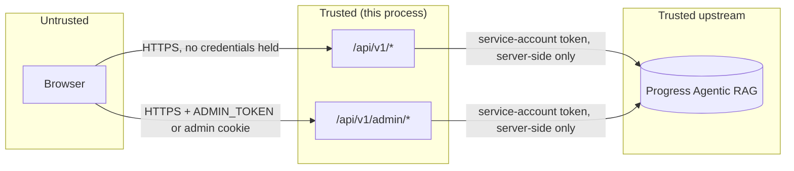

# Security model

This expands [`SECURITY.md`](../../SECURITY.md) into a threat model: what's protected, from whom,
and what the MVP honestly does not cover yet.

## Assets

| Asset | Where it lives | Why it matters |
|---|---|---|
| ARAG service-account token (`ARAG_API_KEY`) | Server process env only | Grants read/write on the entire Knowledge Box — every call recording, transcript and generated analysis |
| Admin token (`ADMIN_TOKEN`) | Server process env only | Grants access to `/admin` and `/api/v1/admin/*`: config (redacted), usage, logs, agent control, provisioning, cache control |
| Call recordings and transcripts | ARAG Knowledge Box | Potentially sensitive: health-insurance calls carry PII/PHI-shaped content by design (the demo taxonomy has a dedicated "Sensitive / PII" moment label) |
| Generated analysis (`call_analysis`, `call_metrics`) | ARAG Knowledge Box | Model-authored judgments (sentiment, compliance score, complaint category) about real people and agents |
| Job records | `DATA_DIR` on the local filesystem/volume | Operational metadata only — no recording bytes are ever written to `DATA_DIR` (D-CA-05 keeps the job input to `{callId, title, transcribed}`) |

## Trust boundaries

The browser is the only untrusted boundary. It never holds the ARAG service-account token or the
admin token in a readable form: media streams and the ask NDJSON stream are both proxied by a
route handler; the admin token is exchanged for an `HttpOnly` cookie at login
(`POST /api/v1/admin/login`) and never stored in `localStorage` or read back by client JavaScript
(`app/admin/login/page.tsx`).

## Authentication and authorization

Three independent mechanisms, layered (`lib/api.ts`'s `authenticate`):

1. **`ADMIN_TOKEN`** — bearer token or the `arag_admin` `HttpOnly` cookie, compared with a
   constant-time equality check (`constantTimeEqual`) to avoid timing side-channels. With no
   `ADMIN_TOKEN` configured, every admin route returns `403` outright rather than silently
   allowing access — admin is opt-in, not fail-open.
2. **`API_KEYS`** (comma-separated) — when set, routes marked `auth: "api"` require `X-API-Key` or
   `Authorization: Bearer` matching one of the configured keys. When unset, reads are open by
   design — this is a demo product with a synthetic dataset, not a multi-tenant SaaS.
3. **Session cookie (`arag_session`)** — `POST /api/v1/session` issues an HMAC-signed,
   short-lived (12 h) cookie so the demo UI can call `auth: "api"` routes without ever holding a
   real key in browser JavaScript. Signed by the platform `App`'s `issueSession`, verified with
   `timingSafeEqual`.
4. **`auth: "write"`** — `POST /api/v1/calls` and `DELETE /api/v1/calls/{id}` change the Knowledge
   Box, so they accept only the admin token or an API key. The session cookie is issued to anyone
   who asks, so it is deliberately *not* accepted here. The single exception is a deployment with
   neither `ADMIN_TOKEN` nor `API_KEYS` set, which can only be a local mock run — and even that is
   refused when `NODE_ENV=production`, with a 403 naming the variables to set
   (DECISIONS D-CA-13).

There is **no per-user identity or per-call authorization** anywhere in this model — see "Known
MVP limitations" below.

## Rate limiting and `TRUST_PROXY`

Per-IP (or per-API-key) token-bucket rate limiting (`RATE_LIMIT_RPS`/`RATE_LIMIT_BURST`,
defaults 5 rps / burst 20; Fly deployment raises this to 10/40). The bucket key is `k:<apiKey>`
when the caller authenticated with a key, otherwise `ip:<clientIp>` — admin-authenticated requests
bypass the limiter entirely (`lib/api.ts`'s `route()`: `if (!spec.noRateLimit && !auth.admin)`).

The client IP is derived per `TRUST_PROXY` (`fly` | `xff` | `none`), because Next.js route
handlers have no access to the underlying socket address:

- `fly` (the deployed default) trusts `Fly-Client-IP`, a header Fly's own edge sets and a client
  behind it cannot forge.
- `xff` trusts the first `X-Forwarded-For` entry — only correct behind a proxy *you* control,
  since any client can set this header directly on an untrusted path.
- `none` puts every caller in a single shared bucket — the safe-by-default failure mode when
  no proxy can be trusted, at the cost of one noisy client being able to exhaust the whole
  service's rate budget.

Blindly trusting `X-Forwarded-For` without a `TRUST_PROXY` gate would let any caller rotate the
header per request and defeat the limiter entirely — this is why the option exists rather than
defaulting to "trust XFF."

## Input validation

Every request body, query parameter and path parameter is validated (and type-coerced) against
the OpenAPI document before a handler ever sees it (`lib/api.ts`'s `route()`, using the platform's
`operationSchemas`/`validate`). Concretely: `question` is bounded to 3–500 characters
(`CALLS_MAX_QUESTION_CHARS`), `page_size` is capped at 200, label filter strings and free-text
search are length-bounded, and admin login/cache/provision bodies reject unknown properties
(`additionalProperties: false`).

## The media `field` allowlist

`GET /api/v1/calls/{id}/media?field=...` is the one place a client supplies an arbitrary-looking
string that gets used to build an ARAG path. It is defended twice: the OpenAPI schema constrains
`field` to `enum: ["media", "transcript"]` (validation rejects anything else before the handler
runs), and the handler/service layer re-checks against `MEDIA_FIELD_ALLOWLIST`
(`services/calls.ts`) independently — belt-and-braces so a future spec edit that loosens the enum
can't silently reopen the hole. This closes the pre-MVP audit finding that "the media route trusts
a caller-supplied `field` name."

## Error hygiene

Every error response is an RFC 9457 `application/problem+json` document
(`type`/`title`/`status`/`detail`/`instance`/`requestId`). `toHttpError` (`lib/api.ts`) maps
`AragError` deliberately: a `401` from ARAG becomes a generic `502` ("ARAG rejected the
service-account token") rather than echoing anything upstream-specific, a `404` becomes this
product's own `notFound()`, and anything else becomes a generic `502`/`500` — the upstream base
URL, KB id and raw ARAG response body are never included in a client-facing response. In
production (`NODE_ENV=production`), an unexpected `500` returns only "Internal server error"; the
`requestId` is the thread back to the server log for a real diagnosis.

## Secret handling

Secrets are environment variables only (`.env` locally, Fly secrets in production) — never
committed, never in `fly.toml`. The structured logger redacts any field whose key matches
`token|key|secret|password` (case-insensitive) plus `authorization`/`cookie` headers specifically,
so a service-account key or admin token cannot end up in the log ring buffer even by accident.
`GET /api/v1/admin/config` returns the effective environment with the same redaction
(`describeEnv`) — a secret shows only as `•••(N chars)`, confirming it's set without revealing it.
`GET /api/v1/admin/health` exposes only the first 8 characters of the KB id, never the full id or
the token.

## Browser-facing headers

Every `/api/v1` response carries `X-Content-Type-Options: nosniff`,
`X-Frame-Options: SAMEORIGIN`, `Referrer-Policy: strict-origin-when-cross-origin` and a
`Permissions-Policy` that denies camera, geolocation and microphone — set in `lib/api.ts`'s
`applyHeaders`, so no handler can forget them.

HTML pages get the same four headers plus a Content-Security-Policy from `next.config.mjs`. The
policy is `default-src 'self'` with three deliberate widenings:

| Directive | Widening | Why |
|---|---|---|
| `script-src` | `'unsafe-inline'` | Next.js emits an inline hydration bootstrap. Removing this needs nonce middleware; tracked below as a known limitation. |
| `script-src`, `style-src` | `https://cdn.jsdelivr.net` | Redoc and Swagger UI are loaded from jsDelivr by the platform's `redocHtml`/`swaggerHtml` helpers. |
| `media-src`, `img-src` | `blob:` / `data:` | The audio and video players and the inline SVG charts. |

`connect-src` stays `'self'`: the browser talks only to this origin, never directly to a Knowledge
Box. `frame-ancestors 'self'`, `base-uri 'self'` and `form-action 'self'` are set. Fly terminates
TLS with `force_https = true`.

## Known MVP limitations

Carried forward honestly from [`SECURITY.md`](../../SECURITY.md):

- **No per-user authentication or per-call authorization.** Anyone who can reach the service and
  satisfy `API_KEYS` (or reach it at all, when `API_KEYS` is unset) can read every call in the
  Knowledge Box. A deployment handling real recordings needs an identity-aware proxy in front, or
  a real authorization check added to `lib/api.ts`.
- **Rate limiting and the response cache are per-process, in-memory.** A multi-machine deployment
  limits and caches *per machine*, not globally — see [Scaling](scaling.md).
- **Job state and the log ring buffer are not an audited store.** They live in `DATA_DIR`
  (JSON files) and process memory respectively; neither is designed for compliance-grade audit
  retention.
- **The service-account key is typically a manager-scope key** (per the original prototype's
  README) rather than a narrowly scoped reader/DA-task key — a live deployment should provision a
  key scoped to only the capabilities this product actually uses (resource read/write, task
  start/stop, labelset write, ask, predict).
- The Content-Security-Policy allows `'unsafe-inline'` scripts because of Next.js' inline
  hydration bootstrap. Closing that requires nonce-based CSP via middleware.
