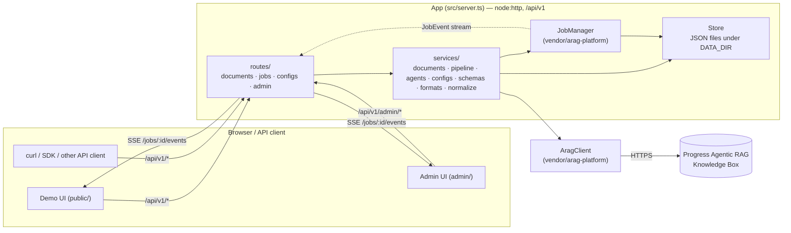

# Architecture

## System overview

## Module map

| Module | Responsibility | Depends on |
|---|---|---|
| `src/index.ts` | Process entry: load env, `createProduct()`, `app.listen()` | `server.ts` |
| `src/server.ts` | Wires middleware, routes, `/api/v1` docs, static UIs; exports `createProduct()` used by tests and `make smoke` | everything below |
| `src/openapi.ts` | The OpenAPI 3.1 document — single source of truth for the public API | platform `openapi/builder.ts` |
| `src/routes/documents.ts` | HTTP surface for upload / list / get / export / ask / delete | `services/documents.ts` |
| `src/routes/jobs.ts` | HTTP surface for job list / get / cancel / SSE events | `JobManager` (platform) |
| `src/routes/configs.ts` | HTTP surface for extraction configs and the schema catalogue | `services/configs.ts`, `services/schemas.ts` |
| `src/routes/admin.ts` | Operator surface: login, health, config, usage, logs, provision, purge | most services + `AragClient` |
| `src/services/documents.ts` | Upload validation (MIME/size), `DocumentsService` (create/list/export/ask/delete/purge), registers the `process-document` job runner | `AragClient`, `Store`, `JobManager`, `pipeline.ts` |
| `src/services/pipeline.ts` | `runPipeline()` — the seven-stage orchestrator, emits `JobEvent`s via `JobContext` | `agents.ts`, `configs.ts`, `schemas.ts` |
| `src/services/agents.ts` | Every ARAG-facing call: classify, extractFields, enrichEntities, summarize, readPersistedFields, search-configuration provisioning | `AragClient` |
| `src/services/schemas.ts` | The 11 built-in `ExtractionSchema`s + custom config builder | — (pure) |
| `src/services/configs.ts` | `ConfigsService` — built-in + persisted custom extraction configs, provisioning orchestration | `Store`, `agents.ts` |
| `src/services/formats.ts` | `DocumentRecord` → JSON / XML / CSV, pure functions | — (pure) |
| `src/services/normalize.ts` | `parseAmount` / `parseDateISO` / `normalizeCurrency`, pure | — (pure) |
| `vendor/arag-platform` | `App` (HTTP toolkit, auth, rate limit, static, docs pages), `AragClient`, `JobManager`, `Store`, `Logger`, mock ARAG, OpenAPI builder/validator | never edited in place |

## Request lifecycle

Every `/api/v1` request goes through the same pipeline in `App.handle()`
(`vendor/arag-platform/src/http/app.ts`):

1. **Middleware** — `securityHeaders()`, `cors()`, a usage counter (`src/server.ts`).
2. **Auth** — `authenticate()` resolves admin token / API key / session cookie from the
   request; `enforceAuth()` checks the route's declared `auth` mode (`"none" | "api" |
   "admin"`) against it.
3. **Rate limiting** — a per-IP-or-API-key token bucket (`RATE_LIMIT_RPS`/`BURST`), skipped
   for admin-authenticated requests and routes marked `noRateLimit` (health, docs, SSE).
4. **Body parsing** — JSON by default; `src/routes/documents.ts` opts into `body: "raw"`
   and parses multipart itself (see [DP-10](../../DECISIONS.md)).
5. **Validation** — `operationSchemas(openapi, path, method)` validates params/query/body
   against the OpenAPI document itself, so the spec and the runtime validation can never
   drift apart.
6. **Handler** — the thin `routes/*.ts` function calls into a `services/*.ts` method and
   returns a plain object (sent as `200 application/json`) or writes the response itself
   (`202`, `204`, a file download, or an SSE stream).
7. **Error mapping** — anything thrown (an `HttpError`, or an `AragError` from a failed
   upstream call) is rendered as RFC 9457 `application/problem+json` with the request's
   `X-Request-Id`.

## The job / SSE model

Document processing is asynchronous by design: `POST /api/v1/documents` returns `202` with
the document (`status: "pending"`) and a **Job** (`kind: "process-document"`) immediately,
before ARAG has done any work.

- `JobManager` (platform) queues the job, runs it with bounded concurrency (`concurrency:
  2` — see [`scaling.md`](scaling.md)), and persists its state (status, progress, events,
  timings) to the `jobs` collection in `Store` after every change.
- `runPipeline()` (`src/services/pipeline.ts`) drives the seven stages — `process →
  classify → extract → entities → summary → validate → standardize` — through a
  `JobContext`: `ctx.stage(name, message, fn, { soft, progress })` times each stage and
  emits `JobEvent`s.
- `GET /api/v1/jobs/{id}/events` is a **view** of that job over Server-Sent Events, not the
  work itself ([DP-02](../../DECISIONS.md)): it replays every event so far, then streams
  new ones as they happen, and closes when the job reaches a terminal status. A client that
  disconnects — or never connects — has no effect on the pipeline; the finished record is
  always available at `GET /api/v1/documents/{id}` regardless.
- Pipeline stages are `soft` ([DP-09](../../DECISIONS.md)): a failing stage records a stage
  error in the job's events and the pipeline continues with the best record it has. Only a
  missing document record fails the job outright. A soft failure is also surfaced on the
  record itself, not just the job: `record.meta.stageErrors` (`"<stage>: <message>"`) is
  set whenever any stage failed, and the same failures are appended to `record.issues` as
  `severity: "error"` — so an API caller who only ever reads `GET /documents/{id}` still
  sees that something degraded, rather than reading a `ready` record with quietly missing
  output as if nothing had gone wrong. The admin panel's Overview tab counts these as
  **degraded** documents.

Full stage-by-stage detail, including what each stage calls in ARAG and why, is in
[`data-flow.md`](data-flow.md) and [`arag-integration.md`](arag-integration.md) (the latter
documents the ARAG-specific mechanics verbatim — don't restate it, link to it).

## Related

- [`data-flow.md`](data-flow.md) — a document's journey end to end, with a sequence diagram.
- [`arag-integration.md`](arag-integration.md) — every ARAG endpoint used and the five hard-won mechanics.
- [`scaling.md`](scaling.md) — where the concurrency and throughput limits are.
- [`security-model.md`](security-model.md) — auth, rate limiting, upload safety.
- [`limits.md`](limits.md) — every hard number in one place.
