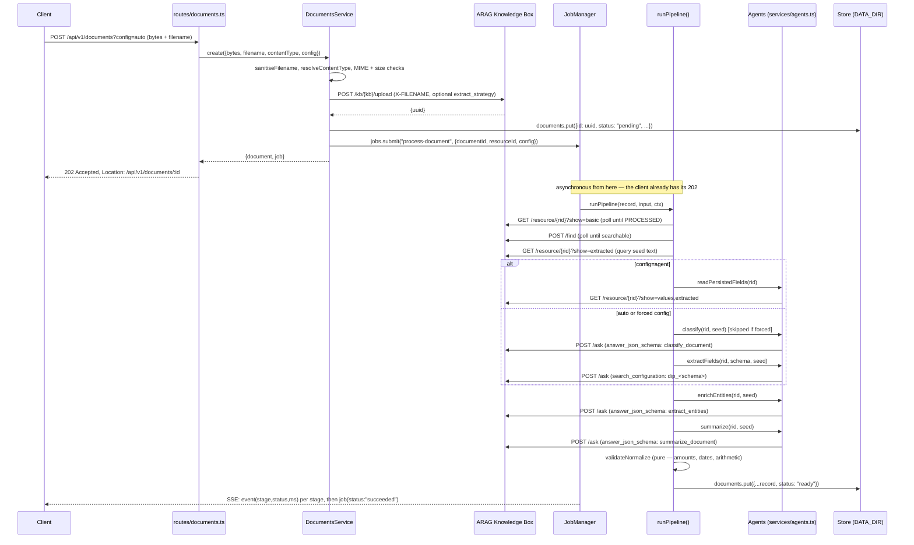

# Data flow

A single document's journey from upload to export, deletion, or a natural-language
question. For the ARAG-specific mechanics referenced below (`full_resource`, the
searchable gate, query seeding), see
[`arag-integration.md`](arag-integration.md#key-arag-mechanics) — not repeated here.

## Sequence: upload → canonical record

## What is stored where

| Data | Where | Leaves the process? |
|---|---|---|
| Original file bytes | ARAG Knowledge Box only (`POST /upload`) | Yes — sent to ARAG over HTTPS at upload time. Not kept on local disk at any point. |
| Canonical `DocumentRecord` (fields, entities, summary, tags, issues, meta) | `DATA_DIR/documents.json` (local JSON store) | No — computed locally from ARAG responses, served back to the caller on request. |
| Job state and event history | `DATA_DIR/jobs.json` | No |
| Custom extraction configs | `DATA_DIR/extraction-configs.json`, and as a stored ARAG search configuration (`dip_<schema>`) | The config's field list and prompt are sent to ARAG as a search configuration; the local copy never leaves the process except via the API. |
| Recent log lines | In-memory ring buffer (last 500), also stdout | No — never persisted to disk; secrets are redacted by key name before either sink. |
| Admin/API session | Signed cookie (`arag_admin` / `arag_session`), HMAC with a server-side secret | The cookie value goes to the browser; nothing is stored server-side (stateless sessions). |

Every ARAG call, in and out, is logged with method/path/status/ms — never the token or the
document body — visible at `GET /api/v1/admin/logs` and counted at
`GET /api/v1/admin/usage`.

## Export

`GET /api/v1/documents/{id}/export?format=json|xml|csv` reads the already-computed
`DocumentRecord` from the store and serialises it (`services/formats.ts`) — no ARAG call.
This is why export is instant even though the original extraction may have taken tens of
seconds against a real KB.

## Ask

`POST /api/v1/documents/{id}/ask` makes exactly one ARAG call at request time
(`POST /ask` with `resource_filters: [resourceId]` and `full_resource` grounding) — nothing
is stored from it beyond the usage counters; the answer is returned directly to the caller
and not persisted on the document record.

## Delete and purge

`DELETE /api/v1/documents/{id}` and `POST /api/v1/admin/purge` both delete the local record
**and** call `DELETE /kb/{kb}/resource/{rid}` — the only way a document's bytes leave the
Knowledge Box. There is no background retention sweep in the MVP; see
[`limits.md`](limits.md) and [`security-model.md`](security-model.md#data-retention).

## Related

- [`architecture.md`](architecture.md) — the system overview and module map.
- [`arag-integration.md`](arag-integration.md) — every ARAG endpoint and the mechanics that make this reliable.
- [`security-model.md`](security-model.md) — retention, redaction, and what an operator must configure.
