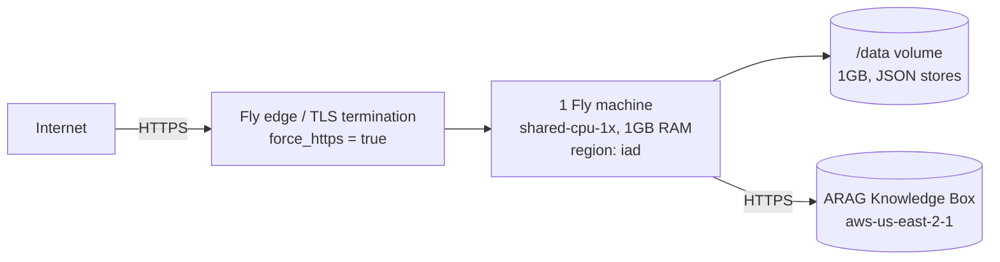

# Deployment topologies

## Local (mock)

```
make dev   → node --watch src/index.ts, ARAG_MOCK=1, DATA_DIR=./data
```

One process, in-process mock ARAG, JSON files on local disk. No credentials, no network
egress except to `localhost`. This is also what `make e2e` and `make showcase` boot
(against `data/e2e` / `data/showcase` respectively) and what CI runs.

## Single Fly machine with a volume (the shipped topology)

This is what `fly.toml` describes and what `arag-doc-processing` runs on Fly today:



Actual `fly.toml` settings:

```toml
app = "arag-doc-processing"
primary_region = "iad"   # co-located with the ARAG zone aws-us-east-2-1

[[mounts]]
  source = "data"
  destination = "/data"
  initial_size = "1gb"

[http_service]
  internal_port = 8080
  force_https = true
  auto_stop_machines = "suspend"
  auto_start_machines = true
  min_machines_running = 1
  [http_service.concurrency]
    type = "requests"
    soft_limit = 30
    hard_limit = 50

[[vm]]
  size = "shared-cpu-1x"
  memory = "1gb"
```

`min_machines_running = 1` with `auto_stop_machines = "suspend"` means Fly can suspend the
machine under no load and resume it (fast, state intact — including anything queued in
memory is lost on a true stop, but the volume persists) rather than cold-starting a fresh
container. `[[http_service.checks]]` polls `GET /healthz` every 15s.

Deploy:

```bash
fly secrets set ARAG_KB_ID=… ARAG_API_KEY=… ARAG_REGION=aws-us-east-2-1 \
                ADMIN_TOKEN=… DIP_EXTRACT_STRATEGY=…
fly deploy
```

Secrets are never in `fly.toml` — only non-secret defaults live in `[env]` (`NODE_ENV`,
`PORT`, `DATA_DIR=/data`, `LOG_LEVEL`, rate-limit defaults, `ARAG_REGION`,
`ARAG_GENERATIVE_MODEL`). `TRUST_PROXY` should stay at its default (`fly`, trusting
`Fly-Client-IP`) in this topology — see
[`security-model.md`](security-model.md#rate-limiting-and-trust_proxy).

This single-machine topology is appropriate for the MVP and for most real evaluation/small
production workloads: the pipeline is ARAG-bound, not CPU-bound (see
[`scaling.md`](scaling.md)), so one machine can drive meaningful throughput before compute
is the constraint.

## Multi-instance considerations

The product **was not built for multiple concurrent instances**, and running more than one
changes behaviour, not just capacity:

- **The JSON store is per-instance.** `Store`/`Collection` (`vendor/arag-platform/src/store/jsonstore.ts`)
  keeps an in-memory index backed by one JSON file per collection under `DATA_DIR`, with no
  cross-process locking or replication. Two instances writing to the same `DATA_DIR` (e.g.
  the same mounted volume) will race and can corrupt or silently drop each other's writes.
  Two instances with *separate* volumes will simply show different documents/jobs/configs
  depending on which instance handled which request — `GET /api/v1/documents/{id}` returns
  404 on the instance that didn't process it.
- **Jobs run in-process.** `JobManager` queues and executes jobs with an in-memory queue and
  `AbortController`s (`concurrency: 2` in this product). There is no distributed job queue:
  a job submitted on instance A only ever runs on instance A, and `GET
  /api/v1/jobs/{id}/events` (SSE) only delivers events if the connecting client hits the
  same instance that is running the job.
- **Sessions are stateless but instance-bound in effect.** Admin/API session cookies are
  HMAC-signed and would verify on any instance sharing the same `sessionSecret` — but
  `sessionSecret` defaults to `ADMIN_TOKEN` (shared, fine) unless a random per-boot secret
  is used (the default when `ADMIN_TOKEN` is unset), in which case sessions only work with
  the instance that issued them.
- **Rate limiting is per-instance.** The token-bucket limiter's bucket map is in memory; N
  instances behind a load balancer effectively give a client N× the configured rate limit.

**Behind a load balancer, use sticky sessions per document/job at minimum**, and put
`DATA_DIR` on a *single* instance's volume (not shared) if you must scale beyond one — which
in practice means: don't horizontally scale this product without first replacing the store
(see [`extension-points.md`](../developer/extension-points.md#swap-the-store)) and moving
jobs to a real queue. This is a known, deliberate MVP limitation, not an oversight — see
[`limits.md`](limits.md).

## Related

- [`scaling.md`](scaling.md) — throughput numbers and what to change first.
- [`security-model.md`](security-model.md) — `TRUST_PROXY`, secrets handling.
- [`limits.md`](limits.md) — the single-instance assumptions in one list.
