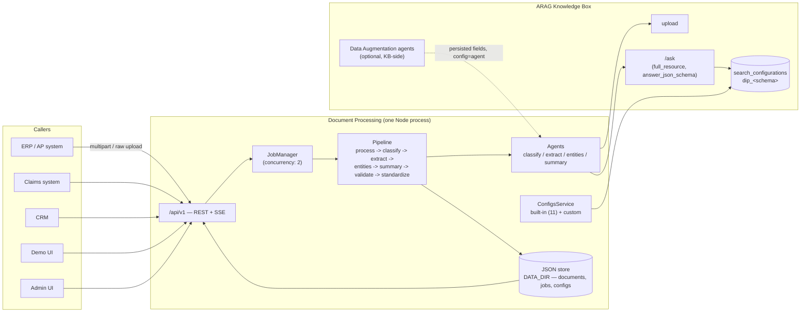

# Document Processing — Architect Workshop

**Time:** 90 minutes. Run this with two or more architects/technical leads in the room
— the discussion scenarios in Part 4 work best argued out loud, not answered silently.

**Format:** four parts. Part 1 (20 min) walks the reference architecture and the
diagram below. Part 2 (25 min) works through four decision points the product actually
made, and asks you to defend or challenge each one. Part 3 (20 min) maps the
architecture onto three integration patterns. Part 4 (25 min) is three scenarios with
model answers — read the scenario, discuss for 5–6 minutes as a group, then compare
against the model answer.

Companion documents: [`sizing-deployment.md`](sizing-deployment.md) (throughput, memory, volume, deployment
shapes) and [`design-review-checklist.md`](design-review-checklist.md) (what to check before signing off a
deployment). This workshop is the "why"; those two are the "how much" and "did we miss
anything." [`knowledge-check.md`](knowledge-check.md) has 12 questions to run afterwards.

---

## Part 1 — Reference architecture (20 min)

Document Processing is one Node process (`src/server.ts`) serving three things over one
port: the public API (`/api/v1`), a demo app (`/`), and an admin panel (`/admin`). It
has zero runtime dependencies and no separate frontend build. Its entire external
dependency is one Progress Agentic RAG (ARAG) Knowledge Box.

Walk the group through the request/response shape for one upload:

1. `POST /api/v1/documents` accepts the file, uploads it to the KB, writes a `pending`
   record, and submits a `process-document` job — then returns `202` **immediately**,
   with the job id in the body and a `Location` header. The upload call does not wait
   for processing.
2. The `JobManager` (concurrency 2 per instance) runs the pipeline: seven stages, each
   emitting events. `GET /api/v1/jobs/{id}/events` is a read-only *view* of that job —
   not the work itself. A closed SSE connection does not stop or restart the pipeline.
3. The pipeline calls into `Agents`, which call ARAG's `/ask` with `resource_filters`
   (never the per-resource ask endpoint — a live ARAG quirk, see
   `docs/architecture/arag-integration.md`) and a `search_configuration` name for the
   schema-driven extraction step.
4. Everything — documents, jobs, extraction configs — persists as JSON files under
   `DATA_DIR`, loaded fully into memory at boot and rewritten atomically on write. There
   is no external database.

**Discussion prompt (5 min):** what does "no external database" buy this product, and
what does it cost? (Answer to seed the discussion: it buys zero operational
dependencies and trivial local dev — `make dev` needs nothing but Node. It costs
horizontal scalability of the *state* — two instances would each have their own,
diverging JSON files — which is why `min_machines_running = 1` and the sizing guide
treats this as a single-instance product for now. See `sizing-deployment.md` §"What to
change first for scale.")

---

## Part 2 — Decision points (25 min)

For each, the model made a specific choice. Discuss whether you'd make the same call in
your own deployment context before reading the "as built" note.

### 2.1 Auto-classify vs. forced config vs. DA agent

Three ways to decide what a document's fields are (`?config=` on upload):

| Mode | What happens | Model calls | When to use |
|---|---|---|---|
| `auto` | An agent classifies the doc type, then the matching schema extracts | classify + extract (+ entities + summary) | Unknown, mixed-source document streams (a general inbox) |
| `<config id>` | Classification skipped; the named built-in or custom schema is forced | extract only (+ entities + summary) | You already know the document type from context (a dedicated upload channel per form type) |
| `agent` | Live extraction skipped; fields an ARAG **Data Augmentation "ask" agent** already wrote on the resource are read instead | 0 (a `getResource` call, not an `/ask` call) + entities + summary | You've configured a persistent DA agent in the KB dashboard and want this product to be a thin reader over it |

**As built:** all three are supported side by side, chosen per upload, not per
deployment — a single instance can serve an "auto" inbox and a "forced" dedicated
channel simultaneously. **Discuss:** is per-upload choice the right granularity for your
integration, or would you want to pin one mode per API key / per caller instead (not
currently supported — it would be a product change, not a config change)?

### 2.2 Stored search configurations vs. inline schemas

Every extraction schema — built-in or custom — is provisioned as a **stored** ARAG
`search_configuration` (`dip_<schema>`, `kind: "ask"`), not sent inline on every
request. Extraction calls only pass `search_configuration: "dip_invoice_extraction"`
plus the per-request bits (query, resource filter, temperature, max tokens).

**As built:** the model, grounding prompt and JSON Schema live **server-side in the
Knowledge Box** — inspectable and tunable in the ARAG dashboard, shared by every client
of that KB. Provisioning is idempotent (`POST`, `PATCH` on 409) and runs at boot, on
config creation, and on demand (`POST /api/v1/admin/provision`). **Discuss:** what
happens in a multi-tenant deployment where two tenants share one KB but want different
generative models for the *same* document type? (As built: they can't — the
configuration name `dip_<schema>` is global to the KB. The realistic answers are either
one KB per tenant, or a tenant-prefixed configuration name — the latter is a product
change worth raising if this comes up.)

### 2.3 Job/SSE model

Long-running work is a platform **job** (`kind: process-document`), not a synchronous
request or a raw streaming endpoint. `202 Accepted` + `Location` on create;
`GET /jobs/{id}` to poll; `GET /jobs/{id}/events` (SSE) to watch live, replaying history
first so a late subscriber sees everything.

**As built:** this is the STANDARDS-mandated pattern for "long work" (§2), and it fixed
a real problem in the prototype this product replaced — a `GET` handler that ran the
whole pipeline as a side effect and lost the result entirely if the client disconnected.
**Discuss:** for a system-to-system integration (not a browser), is SSE the right
notification mechanism, or would you want a webhook callback instead? (As built: no
webhook exists. `GET /jobs/{id}` polling is the fallback for a caller that can't hold an
SSE connection open — see the integration patterns in Part 3.)

### 2.4 Where does the canonical record belong in a wider system?

`DocumentRecord` (the JSON returned by `GET /api/v1/documents/{id}`) is deliberately
"format-agnostic" — typed fields, entities, a summary, validation issues — with JSON,
XML and CSV as pure projections of the same object.

**As built:** this product is a **source of enriched, structured data about one
document**, not a system of record for business objects. It holds the record only as
long as `DATA_DIR` does (no TTL sweeper by default — see DP-08 in the product's
`DECISIONS.md` — retention is an explicit admin action, `POST /api/v1/admin/purge`).
**Discuss:** in your target system, does this product's record get consumed once (an
ERP pulls it, creates its own AP entry, and this product's copy is later purged), or
does something keep polling `GET /api/v1/documents/{id}` as the record's home over
time? The answer changes your retention policy and your integration pattern (Part 3).

---

## Part 3 — Integration patterns (20 min)

### ERP / accounts-payable automation

**Flow:** an AP inbox drops invoices/POs into this product (`?config=auto` or forced to
`invoice`/`purchase_order`); a downstream job polls `GET /api/v1/documents?status=ready&doc_type=invoice`
(or watches jobs via SSE from a lightweight bridge process) and pushes each finished
record's `fields` into the ERP's AP module as a draft entry, using `issues` to flag
anything needing human review (e.g. the `subtotal + tax ≈ total` arithmetic check) before
posting. **Where the canonical record lives:** transient — the ERP becomes the system of
record once it ingests the fields; this product purges on a schedule (`admin/purge`).

### Insurance claims

**Flow:** `medical_claim` and `preauthorisation` are built-in schemas specifically
because claims processing was a named use case. A claims intake system uploads with the
appropriate forced `config`, and treats `validate`-stage `issues` (required-field
misses, amount mismatches) as a triage signal — send clean records straight through,
route flagged ones to a human adjudicator. **Note for the workshop:** claims data is
sensitive (PII, health information) — this pattern must be read alongside
`design-review-checklist.md`'s data-protection section before any real deployment.

### CRM enrichment

**Flow:** a `contract` or `form` upload (e.g. a signed order form attached to a deal)
gets processed, and the extracted `parties`, `effective_date` and `key_obligations` (for
a contract) are written back onto the CRM opportunity/account record via the CRM's own
API — this product is a one-shot enrichment step in someone else's workflow, not a
CRM replacement. The `ask` endpoint is also usable directly from a CRM's UI panel
("ask this contract a question") without any extra integration work, since it's just
one more `/api/v1` call.

**Common thread across all three:** every pattern above treats this product as a
**stateless enrichment step** feeding a system of record elsewhere, not as the system of
record itself. That is consistent with Part 2.4's "as built" note, and it is the
integration shape this architecture was actually designed for.

---

## Part 4 — Discussion scenarios (25 min)

### Scenario A — "Our ERP team wants a webhook, not polling or SSE."

A partner integration team says their ERP's job scheduler can't hold an SSE connection
open and doesn't want to poll every few seconds. They ask whether this product can push
a callback when a document finishes.

Model answer

As built, it can't — there is no outbound webhook. Two honest options to offer them,
in order of effort:

1. **Poll `GET /api/v1/jobs?status=succeeded&ref=<lastSeenId>` (or
   `/api/v1/documents?status=ready`) on an interval.** This needs zero product changes
   and is fine for AP-automation-scale volumes (see `sizing-deployment.md` for what
   "fine" means quantitatively) — a poll every 15–30 seconds is cheap against a JSON
   store with documents in the hundreds to low thousands.
2. **A small bridge process that holds the SSE connection on the ERP's behalf** and
   translates events into whatever the ERP's scheduler *can* consume (a queue message,
   a database row, a file drop). This is infrastructure the integrator owns, not a
   change to this product.

Actually adding outbound webhooks to the product itself is a real, reasonable feature
request — flag it as a roadmap item, not a workaround to hack in during this
integration. Don't build it ad hoc into one deployment's fork.

### Scenario B — "We want to put two business units on one Knowledge Box."

Both business units process invoices, but Unit A wants `chatgpt-azure-4o` as the
generative model (cost/quality trade-off already made) and Unit B wants a different,
cheaper model for the same `invoice` schema. They'd share one KB to simplify billing.

Model answer

This collides directly with Part 2.2: the stored search configuration name is
`dip_invoice_extraction` — global to the KB, one model pinned per name. Sharing one KB
means sharing one model per schema; you cannot have two different models answering to
the same configuration name.

Real options, with trade-offs to name explicitly:

1. **Two Knowledge Boxes** (one per business unit) — clean, no code change, but loses
   the "one KB, one bill" simplification they wanted, and doubles the provisioning
   surface (`ARAG_KB_ID` becomes per-tenant configuration in whatever deploys this
   product for each unit).
2. **Two custom configs on one KB** (e.g. `dip_custom_invoice_unit_b` cloned from the
   built-in `invoice` schema but pointed at Unit B's model) — one KB, but Unit B's
   uploads must be forced to that custom config id (`?config=cfg_...`), not `auto` —
   auto-classification always resolves to the *built-in* `invoice` schema, which is
   pinned to Unit A's model.
3. **Raise it as a genuine product gap** if per-tenant model selection on the *same*
   schema, with auto-classification still working per tenant, is a real recurring need
   — that's a multi-tenancy feature this MVP doesn't have, not a configuration you're
   missing.

Do not recommend "just let Unit B override `generative_model` per request" without
checking whether the product's `/ask` calls for extraction ever accept a per-request
override that bypasses the stored configuration's pinned model — as built, extraction
calls only pass `search_configuration` plus request-scoped fields (query, filters,
temperature, tokens); the model comes from the stored config, full stop.

### Scenario C — "Volume is about to go from 50 documents/day to 50,000/day."

The customer's pilot ran at low volume on a single small Fly machine. They've just
signed a much bigger contract and want to know what breaks first and what to change.

Model answer

Work through `sizing-deployment.md`'s throughput maths with the group rather than
guessing — and check which numbers you're using, because they moved: after DP-19 (the
searchability probe is now seeded with the document's own text instead of a generic
query), a small document's full pipeline run dropped from ~50 s to ~14 s. At concurrency
2, that puts one instance's *theoretical* ceiling around 12,000+ documents/day, and a
realistic planning number (headroom for retries, larger files, bursty arrival) around
5,000–7,000/day for documents of similar size to what was measured. **50,000/day is
still well past a single instance either way** — this scenario is deliberately sized to
land in "needs a real architecture conversation" territory regardless of which set of
numbers you're working from, which is the point: better per-document latency raises the
ceiling, it doesn't remove it.

What breaks first, in order:

1. **Job concurrency (2 per instance)** queues rather than parallelises beyond that —
   the fix is either raising `concurrency` in `new JobManager(store, log, {
   concurrency: 2 })` (a code change, bounded by how many concurrent ARAG calls the KB
   and its rate limits can actually sustain) or running more instances. This alone gets
   nowhere near 50,000/day on one instance even at an aggressive concurrency of 8.
2. **More instances means the JSON store stops working as designed** — it's an
   in-memory-per-process, single-file-per-collection store on one Fly volume; two
   instances writing `documents.json` independently is a correctness bug, not just a
   performance one. Scaling *instances* for this product, today, is not a supported
   path without a shared store — this is the single biggest architectural fact to raise
   with the customer's timeline, because it's a product change, not a `fly scale`
   command.
3. Given (2), there is no vertical-only path to 50,000/day: even a generous
   `performance-2x` instance at concurrency 8 tops out on the order of ~8,000/day
   realistically. This is qualitatively different from the pre-DP-19 conversation, where
   "buy a bigger machine and raise concurrency a bit" was at least a plausible stopgap —
   at this volume it no longer is, and the group should say so plainly rather than
   reach for the familiar vertical-scaling answer out of habit.

The scenario should end with the group agreeing that this volume genuinely requires
replacing the JSON store with a shared database (the platform's own stated GA direction)
before a commitment is made — not a deployment tweak, and not "let's try a bigger Fly
plan and see." This is exactly the kind of finding `design-review-checklist.md`'s
reliability section exists to catch before a customer commitment is made on the
strength of a raw throughput number that improved.

