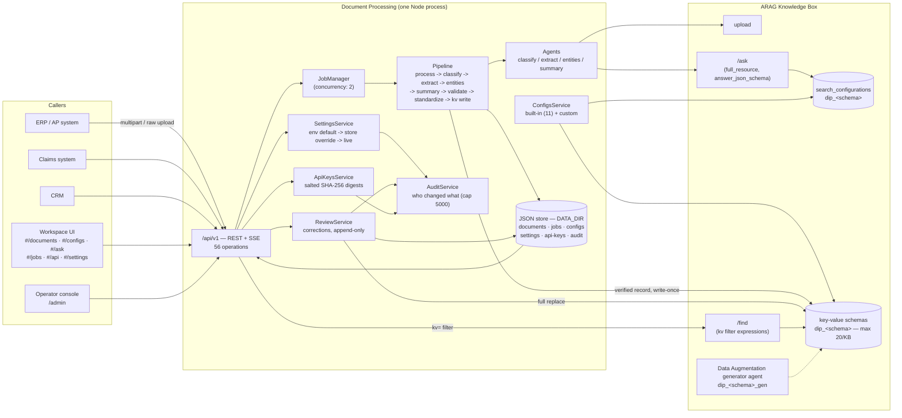

# Document Processing — Architect Workshop

**Time:** a half day — 3 hours 40 minutes including two breaks. Run this with two or more
architects/technical leads in the room; the discussion prompts and the Part 5 scenarios
work best argued out loud, not answered silently.

| | Part | Time |
|---|---|---|
| 1 | Reference architecture | 35 min |
| 2 | Decision points — six calls this product made | 35 min |
| | *break* | 15 min |
| 3 | Key-value schema design, and three findings that constrain it | 45 min |
| 4 | Integration patterns | 25 min |
| | *break* | 10 min |
| 5 | Discussion scenarios | 40 min |
| 6 | Knowledge check and wrap-up | 15 min |

Companion documents: [`key-value-schema-design.md`](key-value-schema-design.md) (Part 3
is that document, read and argued in the room), [`sizing-deployment.md`](sizing-deployment.md)
(throughput, memory, volume, Knowledge Box ceilings, deployment shapes) and
[`design-review-checklist.md`](design-review-checklist.md) (what to check before signing
off a deployment). This workshop is the "why"; those are the "how much" and "did we miss
anything". [`knowledge-check.md`](knowledge-check.md) has the questions for Part 6.

---

## Part 1 — Reference architecture (35 min)

Document Processing is one Node process (`src/server.ts`) serving three things over one
port: the public API (`/api/v1`), a hash-routed workspace (`/`), and an operator console
(`/admin`). It has zero runtime dependencies and no separate frontend build. Its entire
external dependency is one Progress Agentic RAG (ARAG) Knowledge Box.

Walk the group through the request/response shape for one upload:

1. `POST /api/v1/documents` accepts the file, uploads it to the Knowledge Box, writes a
   `pending` record, and submits a `process-document` job — then returns `202`
   **immediately**, with the job id in the body and a `Location` header. The upload call
   does not wait for processing.
2. The `JobManager` (concurrency 2 per instance) runs the pipeline: seven stages, each
   emitting events. `GET /api/v1/jobs/{id}/events` is a read-only *view* of that job —
   not the work itself. A closed SSE connection does not stop or restart the pipeline.
3. The pipeline calls into `Agents`, which call ARAG's `/ask` with `resource_filters`
   (never the per-resource ask endpoint — a live ARAG quirk, see
   `docs/architecture/arag-integration.md`) and a `search_configuration` name for the
   schema-driven extraction step.
4. **When the record finishes, the verified values are written back onto the resource as
   key-value fields**, under the schema the extraction config owns. This is the step that
   makes extracted data filterable by anything with access to that Knowledge Box, not just
   by this product — and it is where Part 3's constraints come from.
5. Everything — documents, jobs, extraction configs, **settings overrides, API keys and
   the audit log** — persists as JSON files under `DATA_DIR`, loaded fully into memory at
   boot and rewritten atomically on write. There is no external database.

### Two things that are new since the prototype, and change the architecture picture

**The configuration is no longer in the environment.** Every setting is editable in the
product, takes effect with no restart, survives a restart, overrides the environment and
is audited (DP-52). Environment variables are *defaults*. The practical consequence for an
architect is that **"what is this deployment configured to do" is no longer answerable
from the repository and the deployment manifest** — it is answerable from
`GET /api/v1/admin/settings`'s `applied` block and from the audit log, and from nowhere
else. Five variables stay environment-only because they are a restart by definition:
`PORT`, `HOST`, `DATA_DIR`, `NODE_ENV`, `ARAG_MOCK`.

**There is a real credential store.** `API_KEYS` (an environment list) still works, but
keys can now be minted, listed, used and revoked through
`/api/v1/admin/api-keys` — the plaintext is returned exactly once and only a salted
SHA-256 digest is kept. A writer credential is any of: a seeded or minted API key, the
admin token, or a same-origin session cookie. Reviewing "is this API protected" now means
reading `applied.security.{apiKeysEnforced, storedApiKeys, seededApiKeys}`, not grepping
for an environment variable.

**Discussion prompt (6 min):** what does "no external database" buy this product, and what
does it cost? (Answer to seed the discussion: it buys zero operational dependencies and
trivial local dev — `make dev` needs nothing but Node. It costs horizontal scalability of
the *state* — two instances would each have their own, diverging JSON files — which is why
`min_machines_running = 1` and the sizing guide treats this as a single-instance product.
Note that the store now also holds the settings overrides, the API keys and the audit log,
so "the JSON store" is no longer just a cache of derived data: losing it loses the
deployment's configuration and its change history too. See
[`sizing-deployment.md`](sizing-deployment.md), "What to change first for scale".)

---

## Part 2 — Decision points (35 min)

For each, the product made a specific choice. Discuss whether you would make the same call
in your own deployment context before reading the "as built" note. Six points, roughly six
minutes each — do not let 2.1 eat the hour.

### 2.1 Auto-classify vs. forced config vs. DA agent

Three ways to decide what a document's fields are (`?config=` on upload):

| Mode | What happens | Model calls | When to use |
|---|---|---|---|
| `auto` | An agent classifies the doc type, then the matching schema extracts | classify + extract (+ entities + summary) | Unknown, mixed-source document streams (a general inbox) |
| `<config id>` | Classification skipped; the named built-in or custom schema is forced | extract only (+ entities + summary) | You already know the document type from context (a dedicated upload channel per form type) |
| `agent` | Live extraction skipped; fields an ARAG **Data Augmentation "ask" agent** already wrote on the resource are read instead | 0 (a `getResource` call, not an `/ask` call) + entities + summary | You have configured a persistent DA agent in the KB dashboard and want this product to be a thin reader over it |

**As built:** all three are supported side by side, chosen per upload, not per deployment.
**Discuss:** is per-upload choice the right granularity for your integration, or would you
want to pin one mode per API key / per caller? (Not currently supported — a product
change, not a config change. Note that now there *are* per-caller API keys to pin it to,
which there were not before.)

### 2.2 Stored search configurations vs. inline schemas

Every extraction schema is provisioned as a **stored** ARAG `search_configuration`
(`dip_<schema>`, `kind: "ask"`), not sent inline on every request. Extraction calls pass
`search_configuration: "dip_invoice_extraction"` plus the per-request bits.

**As built:** the model, grounding prompt and JSON Schema live **server-side in the
Knowledge Box** — inspectable and tunable in the ARAG dashboard, shared by every client of
that KB. Provisioning is idempotent (`POST`, `PATCH` on 409) and runs at boot, on config
creation, on `POST /api/v1/extraction-configs/{id}/provision` for one config, and on
`POST /api/v1/admin/provision` for all of them. **Discuss:** what happens in a
multi-tenant deployment where two tenants share one KB but want different generative
models for the *same* document type? (As built: they cannot — the configuration name is
global to the KB. Realistic answers are one KB per tenant, or a tenant-prefixed
configuration name; the latter is a product change worth raising.)

### 2.3 Job/SSE model

Long-running work is a platform **job** (`kind: process-document`), not a synchronous
request or a raw streaming endpoint. `202 Accepted` + `Location` on create;
`GET /jobs/{id}` to poll; `GET /jobs/{id}/events` (SSE) to watch live, replaying history
first so a late subscriber sees everything.

**As built:** the STANDARDS-mandated pattern for long work, and it fixed a real problem in
the prototype — a `GET` handler that ran the whole pipeline as a side effect and lost the
result entirely if the client disconnected. **Discuss:** for a system-to-system
integration, is SSE the right notification mechanism, or would you want a webhook callback?
(As built: no webhook exists. Polling is the fallback — see Part 5, Scenario A.)

### 2.4 Where does the canonical record belong in a wider system?

`DocumentRecord` is deliberately format-agnostic — typed fields, entities, a summary,
validation issues, evidence — with JSON, XML and CSV as pure projections.

**As built:** this product is a **source of enriched, structured data about one document**,
not a system of record for business objects. It holds the record only as long as
`DATA_DIR` does (no TTL sweeper by default — DP-08; retention is an explicit admin action,
`POST /api/v1/admin/purge`). **Discuss:** in your target system, does this product's record
get consumed once and then purged, or does something keep polling it as the record's home?
The answer changes your retention policy and your integration pattern — and, since this
pass, it also decides whether the key-value fields are a useful query surface or a trap
(Part 3).

### 2.5 Settings are live, layered and audited

Environment variables are defaults; the product's JSON store is the override; the
effective value is live; every change is written to the audit log with who, what and when
(DP-52). Secrets are write-only — `set` plus a four-character `hint`, never a value. A
connection change rebuilds the ARAG client rather than restarting the process, because
`AragClient` captures its credentials in its constructor and everything downstream holds a
proxy instead.

**As built:** the owner's bar was "all of the settings being able to be edited", and a
settings screen that needs a redeploy to take effect is a configuration viewer, not a
settings screen. **Discuss:** this moves a real amount of authority from the deployment
pipeline to whoever holds the admin token — they can now repoint the Knowledge Box, change
the model, raise the upload ceiling, loosen the rate limiter and turn the retention
scheduler off, live, with no review and no deploy. What controls does your organisation
put around that? (As built: the audit log is the only control, it lives in the same JSON
store as everything else, and it is capped at 5000 entries — so an environment with heavy
settings churn silently loses its oldest history. Exporting it is a real operational
requirement, not a nice-to-have. See
[`design-review-checklist.md`](design-review-checklist.md), "Configuration and change
control".)

### 2.6 A human correction is recorded, never applied silently

`PUT /api/v1/documents/{id}/fields/{key}` keeps the previous value, the reason and the
actor on an append-only history; drops the model's confidence and raw value; re-checks the
corrected value against the document's own text with the same evidence contract the
pipeline uses; and lets the grounding score **fall** if the new value does not verify
(DP-49). A corrected field stays in the grounding denominator and counts in the numerator
only when its new value verifies. `meta.correctedFields` is reported alongside the score.

**As built:** a human typing a value does not make it grounded, and claiming the model's
old confidence for a value the model did not produce would be a lie on the most-read number
in the product. **Discuss:** the alternative — excluding corrected fields from the score —
is what most products do, and it makes the number go up rather than down after review. Why
is that worse? (Because it quietly moves the goalposts: a reviewer could raise a record's
score by correcting its worst fields, and the number would stop meaning "the share of this
record's fields that carry a verified quote".)

---

## Part 3 — Key-value schema design, and three findings (45 min)

Work through [`key-value-schema-design.md`](key-value-schema-design.md) in the room. It
covers:

1. What a key-value schema is, why an extraction config owns **two** Knowledge Box objects,
   and why the declared type and the extracted type disagree on purpose.
2. **Finding one — nothing is `required`** (DP-47), and the general lesson about
   constraints that convert partial success into total loss.
3. **Finding two — the overwrite trap** (DP-51): the filter index accumulates every value
   ever written, there is no purge call, and the design rule that follows.
4. **Finding three — filtering is eventually consistent** (DP-55), measured live, with no
   status to wait on, and the three things an architect must not promise.
5. **The ceiling most customers hit first**: 20 key-value schemas per Knowledge Box, 11
   consumed by the built-ins, +1 per generator agent.

Each section has its own discussion prompt. If the room is short on time, the two that
must not be skipped are the overwrite trap and eventual consistency — they are the two
that turn into a customer commitment nobody can keep.

---

## Part 4 — Integration patterns (25 min)

### ERP / accounts-payable automation

**Flow:** an AP inbox drops invoices/POs into this product (`?config=auto` or forced to
`invoice`/`purchase_order`); a downstream job polls
`GET /api/v1/documents?status=ready&doc_type=invoice` (or watches jobs via SSE from a
lightweight bridge process) and pushes each finished record's `fields` into the ERP's AP
module as a draft entry, using `issues` to flag anything needing human review before
posting. **Where the canonical record lives:** transient — the ERP becomes the system of
record once it ingests the fields; this product purges on a schedule.

**Where the key-value fields fit, and do not.** They are genuinely useful for the
analyst's question over settled data — "every invoice over $10,000 from this supplier last
quarter" is one `kv=` filter instead of a full re-read. They are **not** the AP work queue:
that data changes, and a corrected invoice still matches a filter on the value it used to
have (Part 3, finding two). Poll `status`/`has_issues` for the queue; filter `kv=` for the
question.

### Insurance claims

**Flow:** `medical_claim` and `preauthorisation` are built-in schemas because claims
processing was a named use case. A claims intake system uploads with the appropriate
forced `config`, and treats `validate`-stage `issues` as a triage signal — clean records
straight through, flagged ones to a human adjudicator, who corrects fields in the record
view. **Note for the workshop:** claims data is sensitive (PII, PHI), and this pass added a
second place it lives — the key-value fields on the Knowledge Box resource are a
filterable index of member numbers, diagnosis codes and amounts, not just a copy in this
product's store. Read this pattern alongside
[`design-review-checklist.md`](design-review-checklist.md)'s data-protection section before
any real deployment.

### CRM enrichment

**Flow:** a `contract` or `form` upload gets processed, and the extracted `parties`,
`effective_date` and `key_obligations` are written back onto the CRM opportunity via the
CRM's own API — this product is a one-shot enrichment step in someone else's workflow.
Both ask endpoints are usable directly from a CRM panel without extra integration work:
`POST /api/v1/documents/{id}/ask` for "ask this contract a question", and
`POST /api/v1/ask` for "ask across the twelve contracts on this account" (the corpus ask
takes the Documents list's own filters, and returns citations mapped back to this
product's document ids).

**Common thread across all three:** every pattern treats this product as a **stateless
enrichment step feeding a system of record elsewhere**, not as the system of record itself.
That is consistent with 2.4's "as built" note, and Part 3's findings are what happens when
a customer tries to use it as the latter anyway.

---

## Part 5 — Discussion scenarios (40 min)

Four scenarios, roughly ten minutes each: read, discuss for five or six minutes as a group,
then compare against the model answer.

### Scenario A — "Our ERP team wants a webhook, not polling or SSE."

A partner integration team says their ERP's job scheduler cannot hold an SSE connection
open and does not want to poll every few seconds. They ask whether this product can push a
callback when a document finishes.

Model answer

As built, it cannot — there is no outbound webhook. Two honest options, in order of effort:

1. **Poll `GET /api/v1/documents?status=ready` (or `GET /api/v1/jobs?status=succeeded`) on
   an interval.** Zero product changes, and fine for AP-automation volumes — a poll every
   15–30 seconds is cheap against a JSON store with documents in the hundreds to low
   thousands. Note what *not* to poll: a `kv=` filter, which is eventually consistent and
   will not contain the document you are waiting for (Part 3, finding three).
2. **A small bridge process that holds the SSE connection on the ERP's behalf** and
   translates events into whatever the scheduler can consume. Infrastructure the integrator
   owns, not a change to this product.

Adding outbound webhooks to the product is a reasonable feature request — flag it as a
roadmap item, not something to hack into one deployment's fork.

### Scenario B — "We want to put two business units on one Knowledge Box."

Both units process invoices, but Unit A wants `chatgpt-azure-4o` and Unit B wants a
cheaper model for the same `invoice` schema. They would share one KB to simplify billing.

Model answer

This collides with 2.2: the stored search configuration name `dip_invoice_extraction` is
global to the KB, one model pinned per name. Real options, with trade-offs named:

1. **Two Knowledge Boxes** — clean, no code change, but loses the "one KB, one bill"
   simplification and doubles the provisioning surface.
2. **Two custom configs on one KB** (`dip_custom_invoice_unit_b` cloned from the built-in
   but pointed at Unit B's model) — one KB, but Unit B's uploads must be *forced* to that
   config id; auto-classification always resolves to the built-in `invoice` schema.
3. **Raise it as a genuine product gap** if per-tenant model selection on the same schema
   with auto-classification is a recurring need.

Two things to add that were not true before this pass. First, option 2 now costs a
**key-value schema** as well as a search configuration — one KB holds 20 and the built-ins
already use 11, so "just clone a config per tenant" does not scale past a handful of
tenants. Second, the model is now an *editable setting* (`connection.generativeModel`),
which makes it tempting to think a per-request override exists. It does not: extraction
calls pass only `search_configuration` plus request-scoped fields, and the model comes from
the stored config. Changing the setting changes it for everyone on that deployment.

### Scenario C — "Volume is about to go from 50 documents/day to 50,000/day."

The customer's pilot ran at low volume on a single small Fly machine. They have just signed
a much bigger contract and want to know what breaks first.

Model answer

Work through [`sizing-deployment.md`](sizing-deployment.md)'s throughput maths with the
group rather than guessing. At ~14 s per document and concurrency 2, one instance's
*theoretical* ceiling is around 12,000/day and a realistic planning number is
5,000–7,000/day. **50,000/day is well past a single instance either way.**

What breaks first, in order:

1. **Job concurrency (2 per instance)** queues rather than parallelises beyond that. Raising
   it is a code change bounded by what the KB's rate limits sustain — and note the
   per-document budget now includes a key-value write on top of the model calls.
2. **More instances means the JSON store stops working as designed** — in-memory per
   process, one file per collection, one Fly volume. Two instances writing `documents.json`
   independently is a correctness bug, not a performance one. And since this pass the store
   also holds the settings overrides, the API keys and the audit log, so divergence now
   corrupts the deployment's *configuration and change history*, not only its data.
3. Given (2), there is no vertical-only path to 50,000/day.

The scenario should end with the group agreeing that this volume requires replacing the
JSON store with a shared database before a commitment is made — not a deployment tweak,
and not a bigger Fly plan.

### Scenario D — "We'll use the key-value filters as our query layer."

A customer's data team has read the positioning material and is pleased: extracted values
land in the Knowledge Box as typed, filterable fields, so they plan to build their
reconciliation dashboard directly on `kv=` filters, with a nightly job that counts unpaid
invoices by supplier and writes an exception queue. They ask which fields they should add
type overrides to.

Model answer

The question they asked has a good answer, and it is the wrong question. Take them in this
order.

**Answer the question they asked.** Every field they intend to compare or order — amounts,
dates — needs a type override (`kvType: "float"` / `"date"`), because the heuristic maps a
captured string to `text` and a `text` field only supports `eq`. That part of the plan is
sound and this is the right time to design it (Part 3, section 1).

**Then take the plan apart, in three steps.**

1. **The exception queue cannot be built this way.** If the queue is "invoices where
   `status` is unpaid", and the status changes as invoices get paid, every invoice ever
   marked unpaid stays in the queue forever: overwriting a key-value field does not remove
   the old value from the Knowledge Box's filter index and there is no purge call (DP-51).
   The same applies to any field a reviewer corrects. A key-value filter is reliable over
   immutable data and unreliable over mutable data.
2. **The nightly counts cannot be trusted as counts.** A key-value filter is a `/find`
   retrieval, not a `COUNT(*)`; key-value fields are not facetable at all (a filter
   expression is a 422 on `/catalog`), and indexing is a second asynchronous step with no
   status to wait on — measured live, a value written was still not returned by a filter
   66 seconds later, while the matched count moved independently (DP-55). A dashboard that
   reports a number has to be able to say the number is complete. This one cannot.
3. **What they actually want is a system of record, and this product is not one.** That is
   not a limitation to work around; it is 2.4, and it is the shape every one of Part 4's
   integration patterns has. The reconciliation data belongs in their warehouse or their
   ERP; this product's job is to put validated, evidenced values *into* it.

**What to leave them with, so this is not just a no.** The key-value fields are excellent
at the thing they were built for: an analyst's ad-hoc question over a settled corpus —
"every invoice over $10,000 from this supplier in Q2" — answered in the Knowledge Box
without re-reading a single document, by any client of that KB and not only by this
product. Offer them that, plus a nightly export into their warehouse for the dashboard.
And notice that the product does not hide any of this from them: the list response
separates `filters.knowledgeBox` from `filters.local`, `meta.kv.filterIndexStale` and
`superseded[]` are on every corrected record, and the Key-value view states the trap on
screen. A customer who reads the payload finds this out; the architect's job is that they
find out now rather than in month four.

---

## Part 6 — Knowledge check and wrap-up (15 min)

Run [`knowledge-check.md`](knowledge-check.md). Then agree, as a group, the three things
you would raise first in a design review for whatever deployment brought you here, and
check them against [`design-review-checklist.md`](design-review-checklist.md) — the point
is to find out which of your three are not on the list, and whether the list is missing
them or you are.
