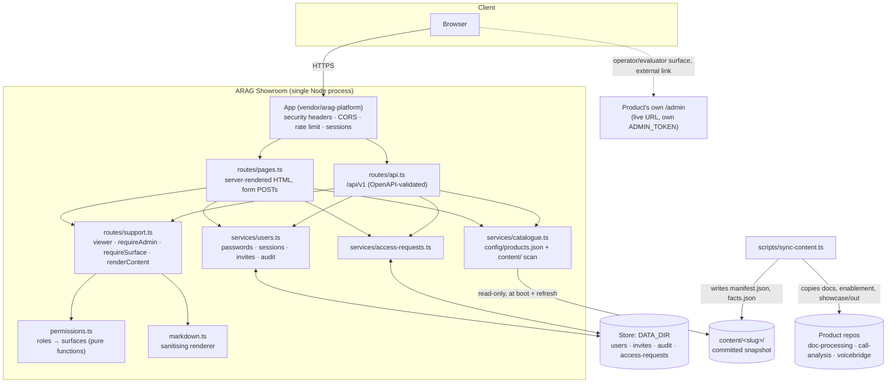
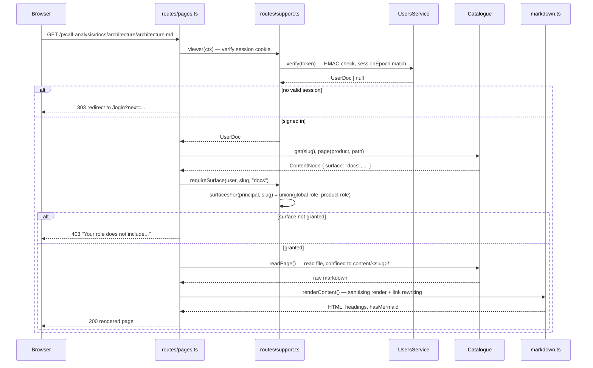

# Architecture

## What the showroom is not

Every other product on this platform wraps a Knowledge Box: it holds `ARAG_KB_ID` / `ARAG_API_KEY`
and talks to ARAG at request time. The showroom does neither. `src/server.ts` never constructs an
ARAG client and never calls `assertAragEnv()`. Its two stores are:

- **A committed content snapshot** (`content/<slug>/`), written ahead of time by
  `scripts/sync-content.ts` from the three product repositories — see
  [content-sync.md](content-sync.md).
- **A small JSON store** (`DATA_DIR`, via the platform's `Store`/`Collection`) holding users,
  invites, the audit log and access requests — the only state that changes at runtime.

## Components



The two front doors — `routes/pages.ts` (HTML) and `routes/api.ts` (JSON) — call the **same**
service objects (`UsersService`, `AccessRequestsService`, `Catalogue`) directly; neither loops back
through HTTP to the other. That is a deliberate STANDARDS deviation recorded as D-S3 in
[DECISIONS.md](../DECISIONS.md): it guarantees the two surfaces can never disagree about what a
role may do, and it means the portal works with JavaScript disabled — every page is server-rendered
and every form is a plain POST.

## Request flow: reading a gated documentation page



## The permission model

`src/permissions.ts` is pure data and pure functions — no HTTP, no storage — so the rules are
unit-testable in isolation and a route literally cannot invent its own reading of a role:

- Five roles (`viewer`, `evaluator`, `operator`, `partner`, `admin`), each mapping to a fixed list
  of **surfaces** (`marketing`, `docs`, `showcase`, `enablement`, `enablement-solutions`,
  `partner-pitch`, `demo`, `admin`).
- A `Principal` carries one global `role` plus a `productRoles` map. `surfacesFor(principal, slug)`
  is the **union** of the global role's surfaces and the product role's surfaces for that slug —
  additive, never subtractive (D-S5).
- `isSiteAdmin(principal)` checks only the global role. Site administration — the user table,
  invites, the audit log — is not a surface at all, precisely so a per-product `admin` role can
  never reach it.
- `surfaceForContentPath(path)` classifies every file under `content/<slug>/` into a surface once,
  so the docs browser, the API's content routes and the raw asset route are all governed by the
  same rule.

## Routes

**Public HTML** (`routes/pages.ts`, no session required): `/`, `/products/:slug`,
`/partners`, `/programme/:doc`, `GET`/`POST /request-access`.

**Auth HTML**: `GET`/`POST /login`, `POST /logout`, `GET`/`POST /invite/:token`.

**Gated HTML** (session required, then per-surface): `/portal`, `/account`,
`GET`/`POST /account/password`, `/p/:slug`, `/p/:slug/docs[/...]`, `/p/:slug/enablement[/...]`,
`/p/:slug/showcase`.

**Administration HTML** (global `admin` role only): `/admin`, `POST /admin/users`,
`POST /admin/users/:id`, `/admin/invites`, `POST /admin/invites`, `POST /admin/invites/:id/revoke`,
`POST /admin/access-requests/:id`, `/admin/audit`, `/admin/system`.

**`/api/v1`**: mirrors every capability above (`auth/*`, `invites/*`, `access-requests/*`,
`users/*`, `products/*` and `products/:slug/content`, `.../assets/:path`, `audit`, `admin/*`) —
see [`/api/v1/docs`](http://localhost:8080/api/v1/docs) for the full, generated contract.

**Platform routes**: `/healthz`, `/readyz`, `/api/v1/openapi.json`, `/api/v1/docs`,
`/api/v1/swagger`; static assets at `/ui/*` (the platform UI kit) and `/assets/*` (`public/`).

## Diagrams render client-side

Architecture diagrams embedded in synced documentation (fenced ```mermaid blocks) are rendered in
the browser by Mermaid, loaded from `https://cdn.jsdelivr.net/npm/mermaid@11/dist/mermaid.min.js`
(`public/mermaid-init.js`), only on pages that contain one. That URL is the one addition the
showroom makes to the platform's default Content-Security-Policy `script-src` (D-S9); see
[SECURITY.md](../SECURITY.md).
